---
lab:
    title: 'Lab 1: Bank foreign currency revaluation'
    module: 'Learning Path 01: Set up and configure financial management; work with General Ledger'
---

**MB-310: Microsoft Dynamics 365 Financial Consultant**

# Change Record

<html>
<table><tr><th>Version</th><th>Date</th><th>Change</th></tr>
<tr><td>1.0</td><td>13 Sep 2024</td><td>Initial release</td></tr>
</table>
</html>

# Objective

# Lab 1 Bank foreign currency revaluation

As part of a period end, accounting conventions require bank account balances in
foreign currencies to be revalued by using different exchange rate types
(current, historical, average, and so on). With the bank foreign currency
revaluation feature, you can revalue one or more bank accounts. Because it’s a
global feature, you can revalue banks across all legal entities you have access
to from a single page.

Use the **USMF** company for the exercises in this lab.

## Exercise 1 Create a transaction that can be revalued 

During this lab, you will first enter a transaction in a bank journal that can
be revalued. The second step is to prepare foreign currency revaluation. After
you configure the foreign currency revaluation, you run the process and then
review the results.

**Scenario**

Contoso, Ltd. has a new financial controller who plans to run a foreign currency
revaluation of bank account USMF EUR as part of the period end. To test the
process, the financial controller first creates a general journal with a
transaction that can be revalued.

1.  In the **USMF** company, navigate to **General Ledger** \> **Journal
    entries** \> **General journals**.

2.  Select the **New** button to create a new journal.
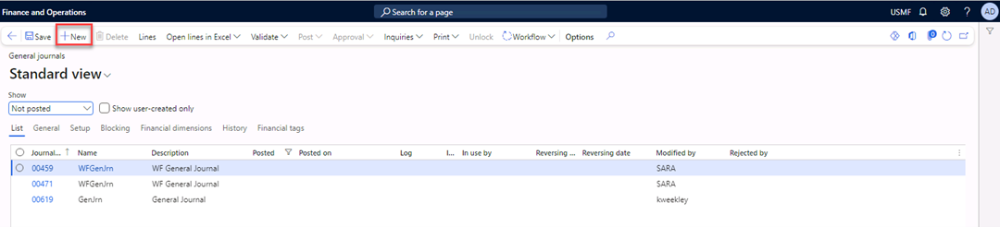

1.  Select **GenJrn** in the **Name** field.

1.  Select the **Lines** button in the Action Pane.
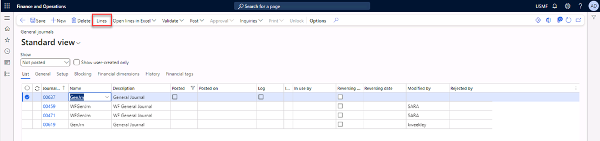

1.  In the **Date** field, enter **7/1/2024**.

2.  In the **Account** field, select **600155** for the **MainAccount, 001** for
    the **BusinessUnit,** and **022** for the **Department**.

3.  In the **Debit** field, enter **1,000.00**.

4.  In the **Offset account type** field, select **Bank**.

5.  In the **Offset account** field, select **USMF EUR**.
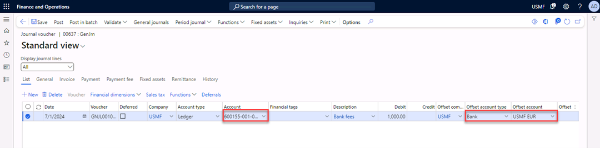

1.  In the **Currency** field, select **EUR**.
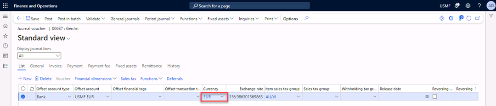

1.  Select **Post** in the Action Pane to post the journal.
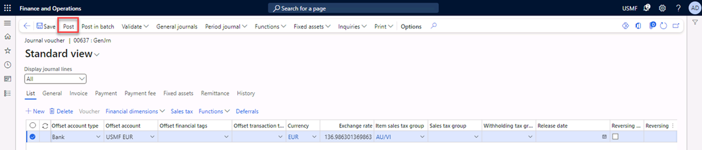

1.  Close the form.

Information: Prepare the foreign currency revaluation
-----------------------------------------------------

Note: This is for informational purposes only; the configuration is already done
in USMF.

1.  In the **USMF** company, navigate to **General Ledger** \> **Ledger setup**
    \> **Ledger**, and then expand the **Currency** tab.

2.  In the **Accounting currency exchange rate type** field, display the
    **Default** value.

3.  Select **Accounts for currency revaluation**.

4.  Review the values for realized gain, realized loss, unrealized gain, and
    unrealized loss accounts for the currency revaluation.
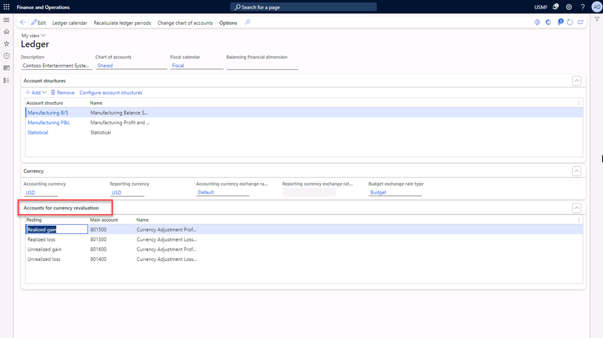

5.  Navigate to **Cash and Bank management** \> **Setup** \> **Cash and bank
    management parameters**.

6.  Select the **Number sequence** tab.

7.  Review the number sequence for **Foreign currency revaluation**.
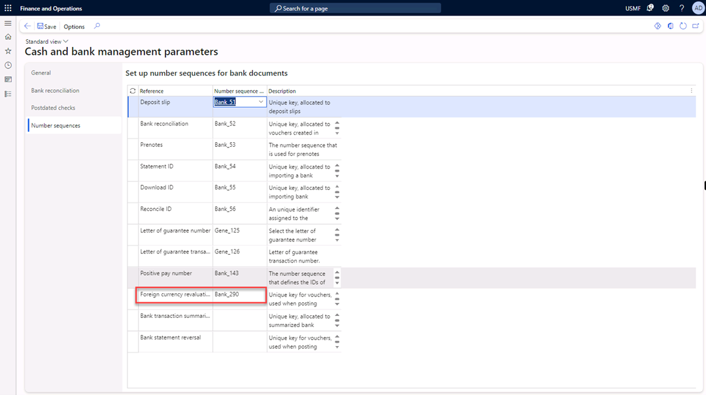

## Exercise 2 Update currency exchange rate

1.  Navigate to **General ledger** \> **Currencies** \> **Currency exchange
    rates**.

2.  In the **Exchange rate type** list, select **Default**.

3.  Select the line with **USD** in the **From currency** field and **EUR** in
    the **To currency.**

4.  Select **Add** to enter a new exchange rate.
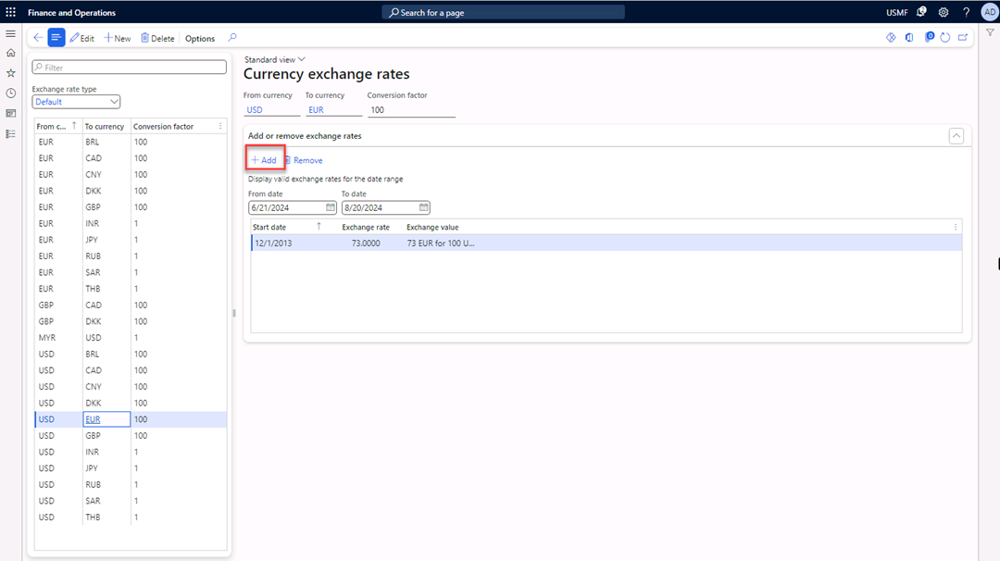

5.  In the **Start date** field, enter **7/15/2024**.

6.  In the **Exchange rate** field, enter **91.8000**.
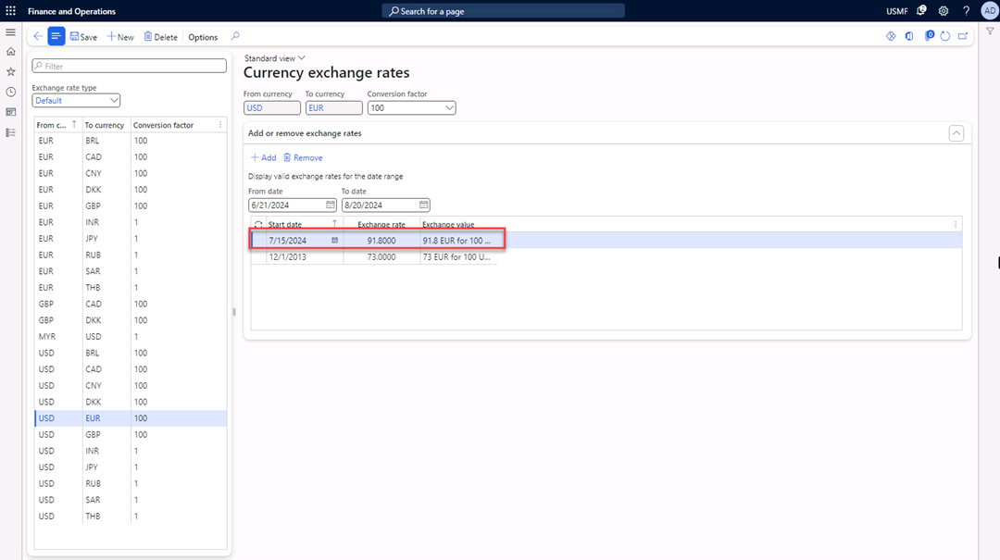

1.  Select **Save** in the Action Pane.

2.  Close the form.

## Exercise 3 Execute the foreign currency revaluation

1.  Navigate to **General Ledger** \> **Currencies** \> **Foreign currency
    revaluation**.

2.  Select the **Foreign currency revaluation** button in the Action Pane.
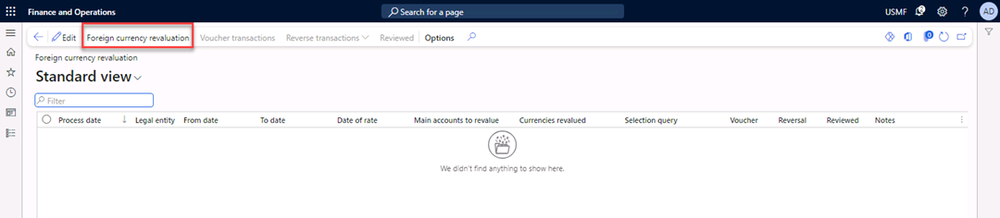

1.  In the **From date** field, enter **7/1/2024.**

2.  In the **To date** field, enter **7/31/2024**.

3.  In the **Date of rate** field, enter **7/21/2024**.

4.  In the **Currencies to revalue** list, select **EUR**.

5.  Switch **Preview before posting** to **Yes**.

6.  Select **Filter**.
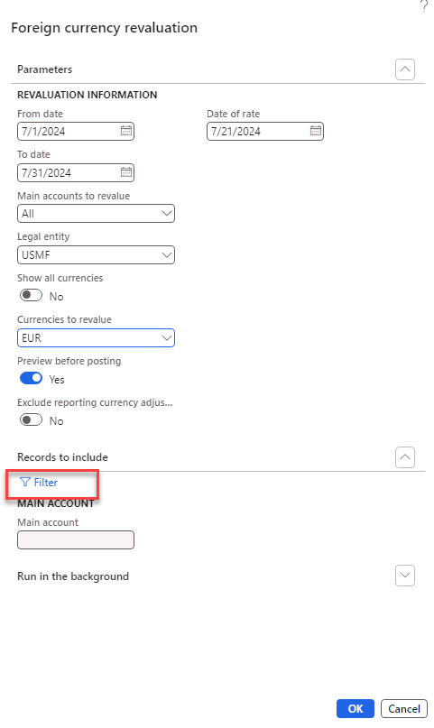

7.  In the **Criteria** field, select the **Main account 110130**.
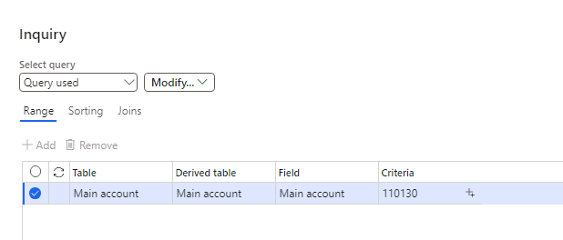

1.  Select **OK** and **OK**.

    The message “Operation completed” appears in the message bar.
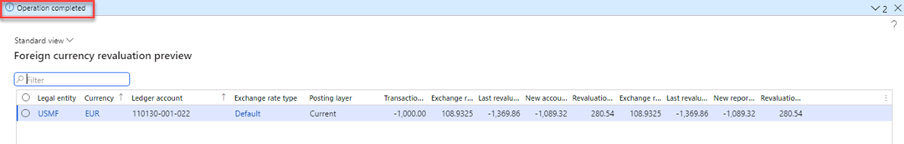

>   **Calculation**

| **Date**     | **Currency EUR-100USD** | **Currency 1 EUR – USD**         | **Currency 1,000 EUR - USD**                               |
|--------------|-------------------------|----------------------------------|------------------------------------------------------------|
| 12/1/2013    | 73 EUR = 100 USD        | 1 EUR = (1 / 0.73) 1.36986 USD   | 1000 EUR = (1000 \* 1.36986) = 1,369.86 USD                |
| 7/15/2024    | 91.80 EUR = 100 USD     | 1 EUR = (1 / 0.9180) 1.08932 USD | 1000 EUR = (1000 \* 1.08932) = 1.089,32 USD                |
| Today’s date |                         | Exchange rate gain               | Revalued amount = 1,089.32 USD – 1,369.86 USD = 280.54 USD |

1.  **Post** the journal.
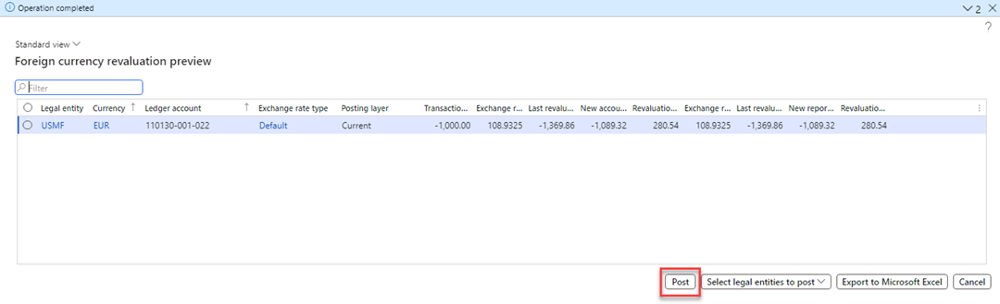

## Exercise 4 Review the voucher and balance of the foreign currency bank account

1.  Select the **Voucher transactions** button in the Action Pane.
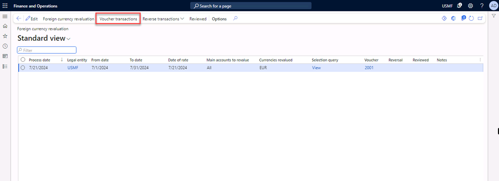

1.  Review the voucher transactions.
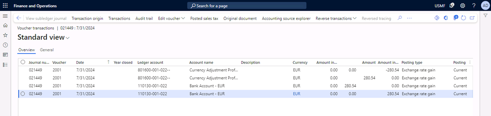

>   The currency EUR has decreased, which is an exchange rate gain for USMF.

1.  Navigate to **General ledger** \> **Inquiries and reports** \> **Trial
    balance**.

2.  In the **From date** field, enter **1/1/2024**.

3.  In the **To date** field, enter **12/31/2024**.

4.  Select **Calculate balances**.
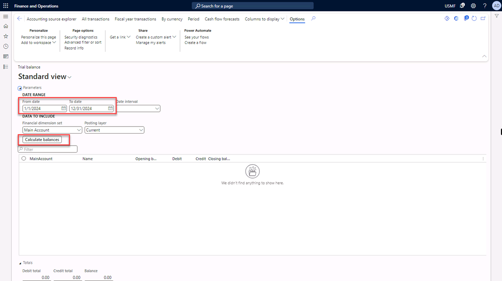

1.  View the balance of main account **110310**.
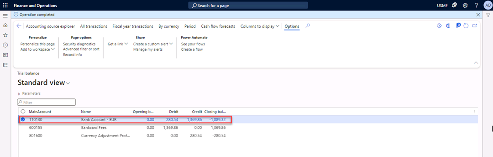

1.  Close the form.
