---
lab:
    title: 'Lab 2: Calculate risk scores'
    module: 'Learning Path 02: Configure credit and collections'
---

**MB-310: Microsoft Dynamics 365 Financial Consultant**

# Change Record

<html>
<table><tr><th>Version</th><th>Date</th><th>Change</th></tr>
<tr><td>1.0</td><td>13 Sep 2024</td><td>Initial release</td></tr>
<tr><td>1.1</td><td>25 Sep 2024</td><td>Corrected title</td></tr>
<tr><td>1.2</td><td>10 Dec 2024</td><td>Workaround for expired certificate</td></tr>
<tr><td>1.3</td><td>13 Jan 2025</td><td>Added business scenario</td></tr>
<tr><td>1.4</td><td>19 Feb 2025</td><td>Added The Why</td></tr>
</table>
</html>

# The Why

In today's dynamic business landscape, understanding and managing risk is paramount to the success and stability of any organization. This hands-on lab will empower you with the ability to calculate risk scores, a critical skill that enables you to identify, assess, and prioritize potential risks effectively. By mastering this process, you'll be equipped to contribute to your organization's risk management strategy, ensuring that potential threats are mitigated before they can impact operations. This lab is a practical tool that will enhance your decision-making capabilities and prepare you to handle real-world challenges with confidence and precision.

# Business scenario
Imagine you are a loan officer at a bank. Your job is to assess the creditworthiness of potential borrowers. To make an informed decision, you need to consider a variety of factors, such as the borrower's income, employment history, and credit score. A high credit score indicates a lower risk of the borrower defaulting on the loan, while a low credit score indicates a higher risk.

In this scenario, the risk score would be a numerical value that summarizes the overall creditworthiness of the borrower. The bank would have a set of criteria for calculating the risk score, and this score would be used to determine whether or not to approve the loan, and if so, what interest rate to charge.

By calculating risk scores, the bank can make more informed lending decisions. This can help to protect the bank from financial losses and ensure that loans are only made to borrowers who are likely to repay them.

Use the USMF company for the exercises in this lab.

## Exercise 1 Configure a scoring group 

During this lab, you will configure a scoring group, add the new group to a
customer, and calculate the risk group classification to determine how risky the
customer is.

### Scenario 

At Contoso, Ltd., the credit management manager wants to configure a new scoring
group that must be used to calculate the customer’s risk.

*Note:* If you get a "Your connection isn't private" error on browser opening, then select the **Advanced** link, select to **Continue**, then wait 2-3 minutes.

1.  Navigate to **Credit and collections** \> **Setup \> Credit management setup
    \> Risk \> Scoring groups** and select **New**.
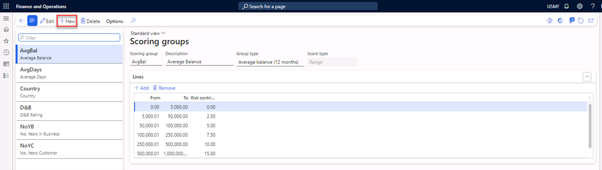

1.  In the **Scoring group** field, enter **CM Group**.

2.  In the **Description** field, enter **Credit management group**.

3.  In the **Group type** field, select the **Credit management group** value.

4.  Navigate to **Lines** \> **Add**.
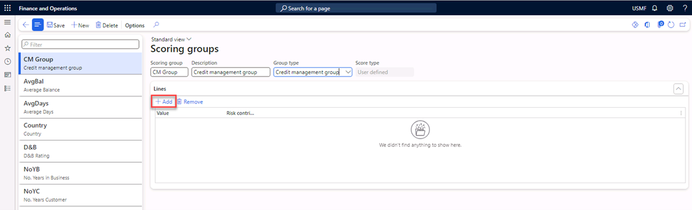

1.  In the **Value** field, select I**ndie**.

2.  In the **Risk contribution score** field, enter **30**.

3.  Select **Add** to add a new line.

4.  In the **Value** field, select the **Major customer** value.

5.  In the **Risk contribution score** field, enter **10**.

6.  Close the form.

## Exercise 2 Add the new scoring group to a customer

1.  Navigate to **Accounts receivable** \> **Customers** \> **All customers**
    and select customer **US-027 Birch Company**.

2.  Select **Edit** in the Action Pane.

1.  Navigate to the **Credit and collections** FastTab.
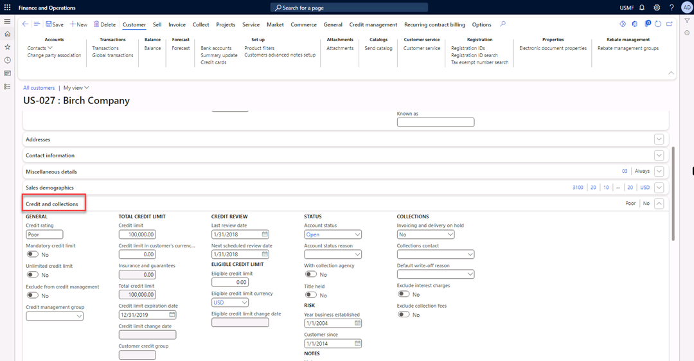

2.  In the **Credit Management group** field, select the **Independent
    Customer** value.
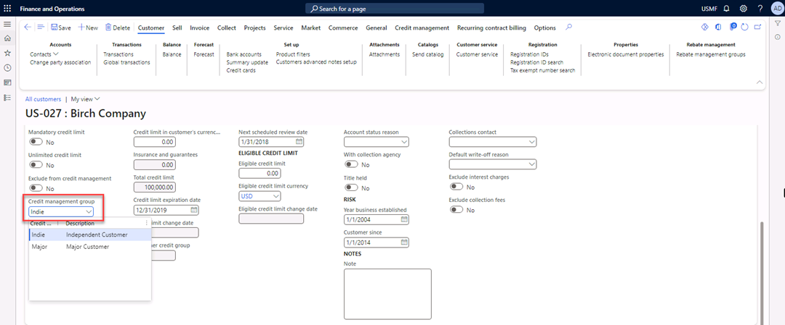

1.  Select **Save** in the Action Pane.
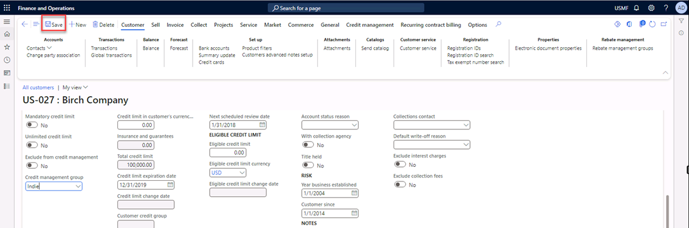

1.  Close the form.

## Exercise 3 Configure risk classification

1.  Navigate to **Credit and collections** \> **Setup** \> **Credit management
    setup** \> **Risk** \> **Risk classification**.
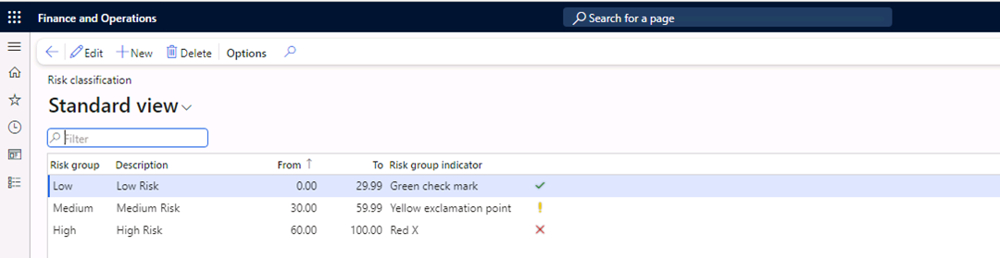

1.  Select **Edit** in the Action Pane.
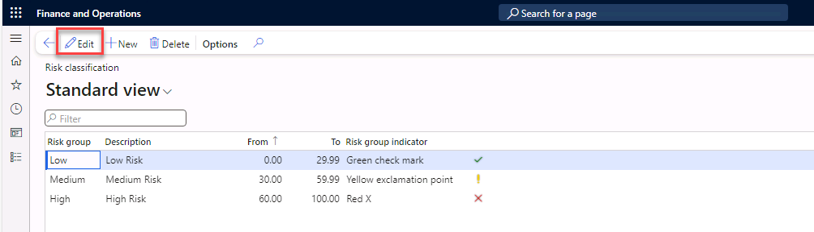

1.  Under **Risk group**, select **Medium**. Then in the **To** field, enter
    **49.99**.

2.  Select **New** in the Action Pane to add a new line.
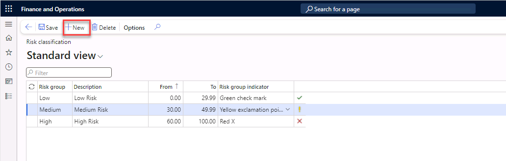

1.  In the **Risk group** field, enter **Med-High**.

2.  In the **Description** field, enter **Medium-High**.

3.  In the **From** field, enter **50**.

4.  In the **To** field, enter **59.99**.

5.  In the **Risk group indicator** field, select the **Orange** value.

6.  Select **Save** in the Action Pane.
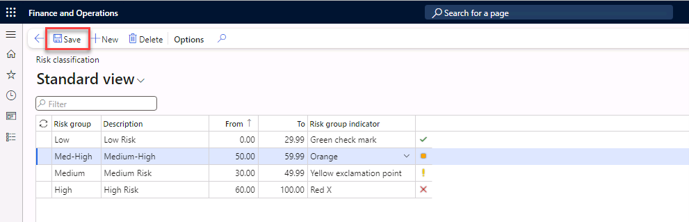

7.  Close the form.

## Exercise 4 Check the risk group of the customer

1.  Navigate to **Accounts receivable** \> **Customers** \> **All customers**,
    and then select customer **US-027 Birch Company**.

2.  Open the **Related information** pane by pressing Ctrl+F2.
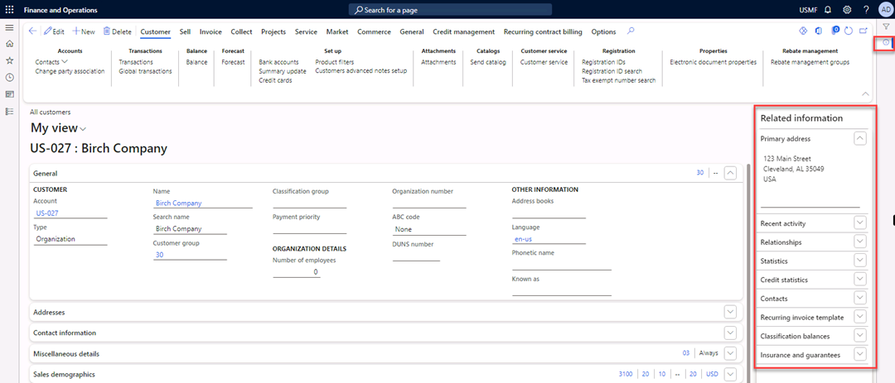

1.  Expand **Credit statistics** and select **Refresh**.
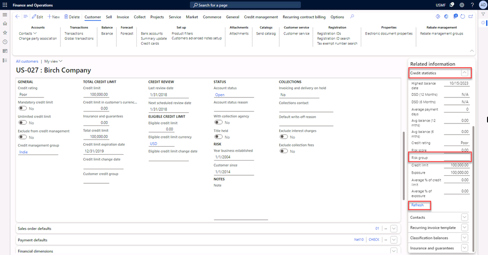

1.  Note that the risk group is **Empty**.

>   In exercise 1, you configured a new scoring group, and then in exercise 2,
>   you added the group to a customer. The new configuration places this
>   customer in a risk group. The new configuration will be apparent after the
>   periodic task **Update risk scores** is performed.

1.  Close the form.

## Exercise 5 Update risk scores

1.  Navigate to module **Credit and collections** \> **Periodic tasks** \>
    Credit management \> **Update risk scores**, and then select Records to
    include \> **Filter**.
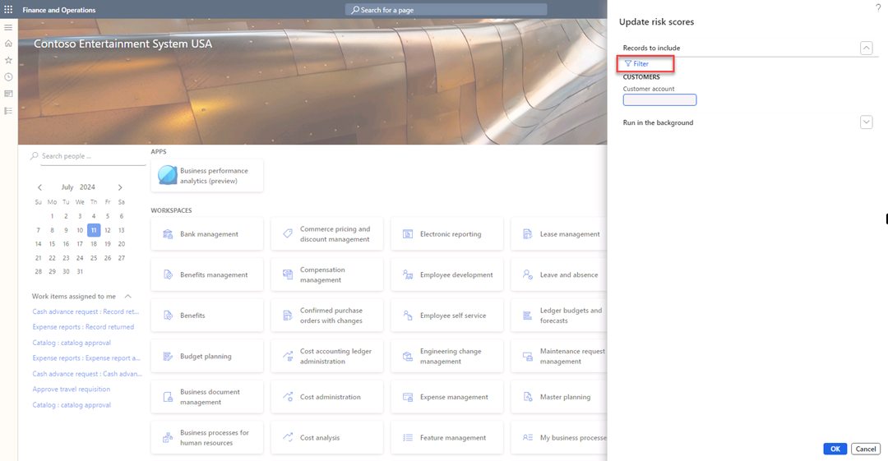

1.  In the **Criteria** field for Customer account, enter the value **US-027**.
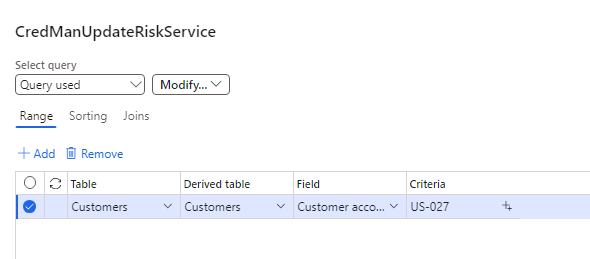

1.  Select **OK,** and **OK**.

## Exercise 6 Check the risk group of the customer

1.  Navigate to **Accounts receivable** \> **Customers** \> **All customers**,
    select customer **US-027 Birch Company.**

2.  Open the **Related information Pane** by pressing **Ctrl+F2**.

3.  Expand **Credit statistics**.

4.  Select **Refresh**. Note that the risk group is changed to **Medium**.
![The Customer page is open and in the Related information pane, the Risk group is highlighted.(images/LP215.png)

1.  Select the **Credit management** tab in the Action Pane.

2.  Select **Risk score**.

3.  View the details of the risk score calculation.
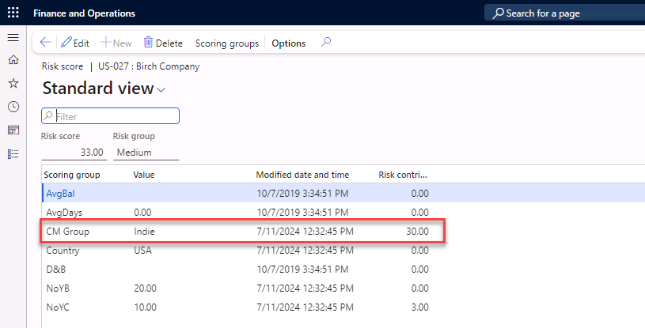

1.  Close the form.
