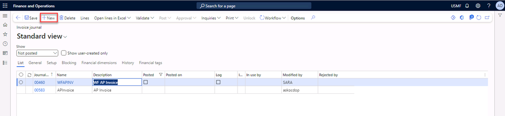

---
lab:
    title: 'Lab 3: Breakdown of voucher'
    module: 'Learning Path 03: Perform accounts payable daily procedures'
---

**MB-310: Microsoft Dynamics 365 Financial Consultant**

# Change Record

<html>
<table><tr><th>Version</th><th>Date</th><th>Change</th></tr>
<tr><td>1.0</td><td>13 Sep 2024</td><td>Initial release</td></tr>
<tr><td>1.1</td><td>10 Dec 2024</td><td>Workaround for expired certificate</td></tr>
<tr><td>1.2</td><td>13 Jan 2025</td><td>Added business scenario</td></tr>
</table>
</html>

# Business scenario
Imagine you are an accounts payable clerk at a company. You receive a vendor invoice that includes multiple tax rates. For example, one portion of the invoice might be subject to a sales tax of 7.25%, while another portion might be subject to a sales tax of 8.25%.

In Microsoft Dynamics 365 Finance, you cannot enter a single invoice line with multiple tax rates. To accurately record the sales tax for each portion of the invoice, you need to break down the voucher.

The voucher breakdown feature in Dynamics 365 Finance allows you to split a single invoice line into multiple lines, each with its own tax rate. This ensures that the sales tax is calculated and recorded correctly for each portion of the invoice.

Use the USMF company for the exercises in this lab.

## Exercise Break down a voucher

During this lab, you will enter a vendor invoice journal by using multiple tax
rates.

**Scenario**

The accounts payable clerk at Contoso, Ltd. receives a vendor invoice with two
tax lines and one net amount. The clerk plans to break down the voucher so the
tax posts correctly. The total net amount is \$10,000, with 7.25 percent charged
on \$7,000 and 8.25 percent on \$3,000.

*Note:* If you get a "Your connection isn't private" error on browser opening, then select the **Advanced** link, select to **Continue**, then wait 2-3 minutes.

1.  Navigate to **Accounts payable** \> **Invoices** \> **Invoice journal**.

2.  Select the **New** button to create a new journal.

1.  In the **Name** field, select **APInvoice**.

1.  Select the **Lines** button in the Action Pane.

1.  In the **Date** field, select today for the date.

2.  In the **Account** field, enter **US-111**.

3.  In the **Invoice date** field, enter **7/10/2024**.

4.  In the **Invoice** field, enter **125**.

5.  In the **Description** field, enter **Office supplies**.

6.  In the **Credit** field, enter **\$10,000**.

7.  Note that **Offset account** was filled automatically with main account
    **606300**.

8.  Select **Functions** \> **Breakdown of voucher** from the lines header, not
    the Action pane.

1.  In the **Sales tax group** field, select **CA**.

1.  In the **Item sales tax group** field, select **AU/VI**.

    Note that the amount in the **Amounts include sales tax** column and the
    amount in the **Sales tax amount** column are changed.

1.  In the **Amount excl. sales tax** field, enter **7,000**.

1.  Navigate to the lower part of the page. In the **Debit** field, enter
    **7,000**.

1.  Select **New** in the Action Pane to create a new line in the upper part of
    the page.

1.  In the **Sales tax group** field, select **CALA**.

1.  In the **Item sales tax group** field, select **AU/VI**.

2.  Navigate to the lower part of the page and select **Add** to add a line in
    the lower part.

1.  In the **Ledger account** field, enter **606300-001----**.

1.  Select **Save** in the Action Pane.

1.  The **Update** button is available after saving the data. Select **Update**
    in the Action Pane.

Note that the original line is reversed and two new lines are created according
to the breakdown of the voucher.

1.  Scroll to the right to review the **Sales tax groups**.

1.  Select **Post** in the Action Pane.

1.  After the message “Operation completed” appears, close the form.

