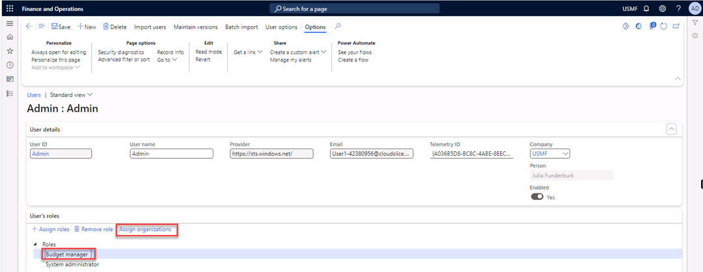

---
lab:
    title: 'Lab 4: Budget planning'
    module: 'Learning Path 04: Configure and use budget planning'
---

**MB-310: Microsoft Dynamics 365 Financial Consultant**

# Change Record

<html>
<table><tr><th>Version</th><th>Date</th><th>Change</th></tr>
<tr><td>1.0</td><td>13 Sep 2024</td><td>Initial release</td></tr>
<tr><td>1.1</td><td>10 Dec 2024</td><td>Workaround for expired certificate</td></tr>
<tr><td>1.2</td><td>13 Jan 2025</td><td>Added business scenario</td></tr>
</table>
</html>

# Business scenario
You are a retail company manager tasked with creating a budget for your department. To develop a realistic budget, you need to consider factors like sales forecasts, expense trends, and strategic goals.

Microsoft Dynamics 365 Finance can help you create different budget scenarios based on various assumptions. For example, you could create a base case scenario, an optimistic scenario, and a pessimistic scenario.

By considering different budget scenarios, you can make informed decisions about resource allocation and improve your department's financial performance.

Use the USMF company for the exercises in this lab.

### Scenario

The budget manager of Contoso Entertainment Systems USA wants to use budget
planning for the next fiscal quarter, Quarter 4 - 2024. The budget manager needs
to configure budget planning in Dynamics 365 Finance first.

## Exercise 1 Configure user security

Budget planning uses special security policies.

*Note:* If you get a "Your connection isn't private" error on browser opening, then select the **Advanced** link, select to **Continue**, then wait 2-3 minutes.

1.  Navigate to **System Administration** \> **Users** \> **Users**.

2.  In the **User name** column, select **Admin**.

1.  Select **Assign roles**.

1.  In the **Assign roles to user** pane, select **Budget Manager**, and then
    select **OK**.

1.  Under **Roles**, select **Budget manager** and select **Assign
    organizations**.

1.  Select **Grant access to specific organizations individually**.

2.  In the **Select organization hierarchy** list, select **Budgeting –
    Departments**.

3.  Expand the **Finance** node.

1.  Select **Grant**.

1.  Repeat step 10 for all departments under Finance.

1.  Select **Save** in the Action Pane.

2.  Close the form.

## Exercise 2 Configure the budget model

1.  Navigate to **Budgeting** \> **Setup** \> **Basic budgeting** \> **Budget
    models**.

2.  Select **New** in the Action Pane.

3.  In the **Budget model** field, enter **FY2024-Q4**.

4.  In the **Name field**, enter **FY2024-Q4**.

1.  Select **Save** in the Action Pane.

## Exercise 3 Configure a fiscal calendar

1.  Navigate to **General ledger** \> **Calendars** \> **Fiscal calendars**.

2.  Select **New calendar** in the Action Pane.

3.  In the Create a new fiscal calendar dialog, enter the following information:

4.  In the **Calendar** field, enter **Budget**.

5.  In the **Description** field, enter **Budget planning**.

6.  In the **Start of fiscal year** field, enter **10/01/2024**.

7.  In the **Length of period** field, enter **3**.

8.  In the **Unit** field, select **Months**.

1.  Select **Create**.

1.  Close the form.

## Exercise 4 Configure a budget cycle

1.  Navigate to **Budgeting** \> **Setup** \> **Budget planning** \> **Budget
    cycles**.

2.  Select **New** in the Action Pane.

3.  In the **Budget cycle time span** field, enter **2024 Q4**.

4.  In the **Fiscal calendar** field, select **Budget**. (Review exercise 3 if
    Budget does not appear).

5.  In the **Length of budget cycle** field**,** select **Map to fiscal year**.

6.  Under **Budget cycle**, select **Add**.

1.  In the **Name** field, enter **2024-Q4**.

2.  In the starting period field, enter **10/01/2024**.

1.  Select **Save** in the Action Pane.

2.  Close the form.

## Exercise 5 Budget planning configuration

### Parameters

1.  Navigate to **Budgeting** \> **Setup** \> **Budget planning** \> **Budget
    planning configuration**.

2.  Select the **Parameters** tab.

3.  In the **Security model** field, select **Based on security organizations**.

### Scenarios

1.  Select the **Scenarios** tab, and then select **Add**.

2.  In the **Budget plan scenario** column, enter **Budget planning 1**.

3.  In the **Description** column, enter **Budget demand by department**.

4.  In the **Unit of measure class** column, select **Monetary**.

1.  Select **Add**.

2.  In the **Budget plan scenario** column, enter **Budget planning 2**.

3.  In the **Description** column, enter **Budget approved by Finance**.

4.  In the **Unit of measure class** column, select **Monetary**.

5.  Select **Add**.

6.  In the **Budget plan scenario** column, enter **Budget planning 3**.

7.  In the **Description** column, enter **Budget approved by CFO**.

8.  In the **Unit of measure class** column, select **Monetary**.

1.  Select **Save** in the Action Pane.

### Stages

1.  Select the **Stages** tab, and then select **Add**.

1.  In the **Budget planning stage** column, enter **Planning 1**.

2.  In the **Description** column, enter **Initial Budget Plan generated by
    Finance**, and then select **Add**.

3.  In the **Budget planning stage** column, enter **Planning 2**.

4.  In the **Description** column, enter **Budget Plan finalized by
    Department**, and then select **Add**.

5.  In the **Budget planning stage** column, enter **Planning 3**.

6.  In the **Description** column, enter **Budget Plan reviewed by Finance**,
    and then select **Add**.

7.  In the **Budget planning stage** column, enter **Planning 4**.

8.  In the **Description** column, enter **Final approval CFO**.

1.  Select **Save** in the Action Pane.

### Workflow stages

1.  Select the **Workflow stages** tab, and then select **Add**.

1.  In the **Budget planning workflow** and the **Description** fields, enter
    **Quarter budget**.

2.  In the **Workflow ID** field, select **000153**.

3.  In the **Remaining planning stages** list, select **Planning 1** and add it
    to the **Selected planning stages** list.

4.  Repeat step 4 for **Planning 2**, **Planning 3**, and **Planning 4**. You
    can do them all together if you like.

1.  Select **Save** in the Action Pane.

### Columns

1.  Select the **Columns** tab, and then select **Add**.

    

2.  In the **Name** and **Description** fields, enter **Budget plan
    department**.

3.  In the **Budget plan scenario** list, select **Budget planning 1**.

4.  In the **Column time period** field, select **Quarter**.

5.  In the **Quarter number** field, enter **4**.

    

6.  Select **Add** again.

7.  In the **Name** and **Description** fields, enter **Budget plan approved by
    Fin**.

8.  In the **Budget plan scenario** field, select value **Budget planning 2**.

9.  In the **Column time period field**, select **Quarter**.

10. In the **Quarter number** field, enter **4**.

11. Select **Add**.

12. In the **Name** and **Description** fields, enter **Budget plan approved by
    CFO**.

13. In the **Budget plan scenario** field, select **Budget planning 3**.

14. In the **Column time period field**, select **Quarter**.

15. In the **Quarter number** field, enter **4**.

1.  Select **Save** in the Action Pane.

### Layouts

1.  Select the **Layouts** tab, and then select **Add**.

1.  In the **Name** and **Description** fields, enter **Budget plan
    department**.

2.  In the **Ledger dimension set** field, select **MA+BU+DEPT**.

3.  Under **Layout elements**, select **Add**.

1.  In the **Element** field, select **Budget plan department**.

2.  Enable the **Editable** field (which should enable **Available in
    worksheet**), and then select **Add**.

3.  In the **Element** field, select **Budget plan approved by Fin**.

4.  Enable the **Editable** and **Available in Worksheet** fields, and then
    select **Add**.

5.  In the **Element** field, select **Budget plan approved by CFO**.

6.  Enable the **Editable** and **Available in Worksheet** fields.

7.  Select **Descriptions**.

1.  In the **Available fields** list, select **MainAccount, BusinessUnit**, and
    **Department** and add them to the **Selected Fields** list.

1.  Select **OK**.

2.  Select **Template** \> **Generate**.

A message box warning you that generating a template or enabling mass update for
the layout will lock the layout for editing appears. The message also warns that
the template will be deleted if modified.

1.  Select **Yes** in the message box.

2.  Select **Save** in the Action Pane.

3.  **Close** the form.

## Exercise 6 Budget planning process

1.  Navigate to **Budgeting** \> **Setup** \> **Budget planning** \> **Budget
    planning process**.

2.  Select **New**.

3.  In the **Budget planning process** and **Description** fields, enter
    **Budget planning 2024 Q4**.

4.  In the **Budget cycle** field, select **2024-Q4**.

5.  In the **Ledger** field, select **USMF**.

6.  In the **Default account structure** field, select **Manufacturing P&L**.

7.  In the **Organization hierarchy field**, select **Budgeting – Departments**.

8.  Select **Assign workflow.**

In the **Organization type** field, select **Department**.

In the **Budget planning workflow** field, select **Quarter budget**.

Select **Assign**. The **Budget planning workflow** and **Workflow ID** fields
are automatically filled for all departments.

Under **Budget planning stage rules and layouts**, select **Quarter budget**.

In the **Budget planning stage** field, select **Planning 1**.

Enable **Add lines** and let it turn on **Modify Lines**.

In the **Layout** field, select **Budget plan department**. Repeat this step for
**Planning 2**, **Planning 3**, and **Planning 4**.

Select **Actions** in the Action Pane.

Under **Process state**, select **Activate**.

Review the message.

Close the form.

## Exercise 7 Generate a General journal

Because no journals are available for FY 2024 in Contoso Entertainment System
USA, you need to create a general journal to use the **General budget plan**
from the General ledger.

1.  Navigate to **General ledger** \> **Journal entries** \> **General
    journals**.

2.  Select **New** in the Action Pane.

1.  In the **Name** field, select **GenJrn**.

1.  Select **Lines** in the Action Pane.

1.  In the **Date** field, enter **10/8/2024**.

2.  In the **Account** field, enter **600170-001-022—**.

3.  In the **Debit** field, enter **4,500**.

4.  Select **New** (line).

5.  In the **Date** field, enter **10/8/2024**.

6.  In the **Account** field, enter **603100-001-022--**.

7.  In the **Debit** field, enter **6,200**.

8.  Select **New** to add a line.

9.  In the **Date** field, enter **10/8/2024**.

10. In the **Account** field, enter **401200-001-022—**.

11. In the **Credit** field, enter **10,700**.

1.  Select **Post** in the Action Pane.

2.  Close the form.

## Exercise 8 Generate a budget plan from the general ledger 

1.  Navigate to **Budgeting** \> **Periodic** \> **Generate budget plan from
    general ledger**.

1.  In the **Fiscal year** field, enter **2024**.

2.  In the **From period** field, enter **Period 10**.

3.  In the **To period** field, enter **Period 12**.

4.  In the **Account type** list, select the **Expense** and **Revenue** values.

1.  In the **Budget planning process** field, select **Budget planning 2024
    Q4**.

2.  In the **Budget plan name** field, enter **Budget planning 2024 Q4**.

3.  In the **Budget plan scenario** field, select **Budget planning 1**.

4.  Select **Generate**.

The budget plan is generated.

1.  Navigate to **Budgeting** \> **Budget plans**.

2.  Select and open the first budget plan named **Budget planning 2024 Q4**.

1.  Select **Worksheet** in the Action Pane.

2.  Select **Download**.

1.  Select **Open file**.

2.  **Close** the Activation Wizard.

3.  In the message bar, select **Enable editing**.

1.  Trust this add-in, if applicable, and **Sign in** with your credentials.
    [Note: if you get an error on signin, clear your temp files and try again.]

>   The department manager can prepare the budget plan for Quarter 4.

1.  Select **Publish**.

1.  Close the workbook.

2.  Refresh the page in Dynamics 365 Finance. You’ll see the budget numbers you
    entered.

1.  Select **Workflow** in the Action Pane.

1.  Select **Submit**.

>   The finance department will need to review and approve the budget plan.
