---
lab:
    title: 'Lab 5: Sell and purchase a fixed asset'
    module: 'Learning Path 05: Manage fixed assets'
---

**MB-310: Microsoft Dynamics 365 Financial Consultant**

# Change Record

<html>
<table><tr><th>Version</th><th>Date</th><th>Change</th></tr>
<tr><td>1.0</td><td>13 Sep 2024</td><td>Initial release</td></tr>
<tr><td>1.1</td><td>10 Dec 2024</td><td>Workaround for expired certificate</td></tr>
<tr><td>1.2</td><td>13 Jan 2025</td><td>Added business scenario</td></tr>
<tr><td>1.3</td><td>19 Feb 2025</td><td>Added The Why</td></tr>
</table>
</html>

# The Why

Managing fixed assets is a fundamental aspect of financial operations in any organization, impacting everything from tax reporting to financial planning. This hands-on lab will provide you with the skills to effectively sell and purchase fixed assets within Microsoft Dynamics 365 Finance. By mastering these processes, you'll ensure accurate asset tracking, optimize asset utilization, and support strategic financial decisions. This lab will empower you to handle real-world financial transactions with confidence and precision, ultimately contributing to the financial health and efficiency of your organization.

#  Business scenario
Imagine you are the manager of a manufacturing company. You recently purchased a new piece of machinery to increase production capacity. This machinery is considered a fixed asset, as it will be used for several years in the manufacturing process.

On the other hand, due to space constraints and the availability of a more advanced model, you might decide to sell an older piece of machinery. This sale would involve recording the disposal of the fixed asset and recognizing any gain or loss from the sale.

Microsoft Dynamics 365 Finance can help you manage these transactions, including recording the purchase of new fixed assets and the sale of old ones. This ensures your accounting records accurately reflect the company's fixed assets and related financial performance.

Use the **USMF** company for the exercises in this lab.

During this lab you will sell a fixed asset and purchase a fixed asset.

**Scenario**

An accounting manager at Contoso, Ltd. needs to sell an LCD monitor that is
activated in the balance sheet. The accounting manager also needs to purchase a
laptop for a new colleague.

## Exercise 1 Review the value of the fixed asset

*Note:* If you get a "Your connection isn't private" error on browser opening, then select the **Advanced** link, select to **Continue**, then wait 2-3 minutes.

1.  Navigate to **Fixed assets** \> **Fixed assets** \> **Fixed assets**.

2.  Select the fixed asset **COMP-000003**.

3.  Select **Valuations** in the Action Pane.
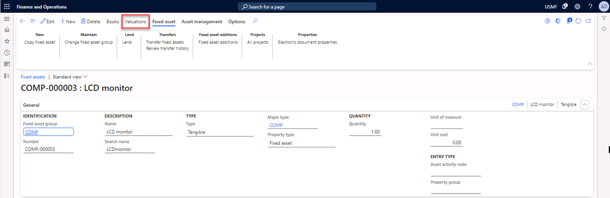

1.  Review the net book value of the asset.
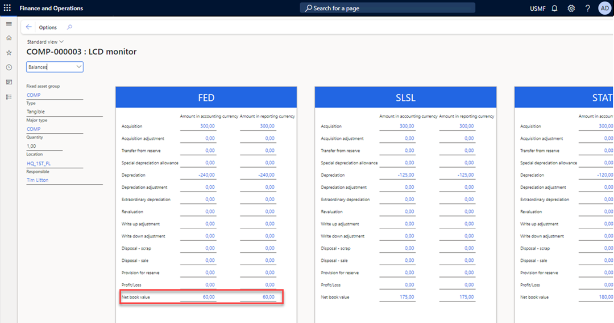

1.  Close the form.

## Exercise 2 Sell the fixed asset

1.  Navigate to **Accounts receivable** \> **Invoices** \> **All free text
    invoices**.

2.  Select **New** in the Action Pane.
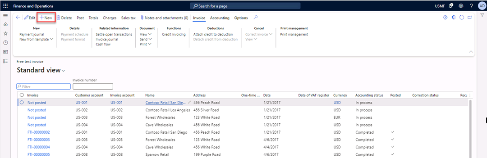

1.  In the **Customer account** field, select **US-011**.

2.  Select the **Line details** FastTab.
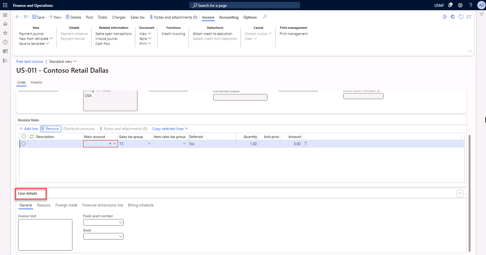

1.  In the **Fixed asset number** field, select **COMP-000003**.

>   The main account field is automatically filled with the main account number
>   that is set up in the posting profile.
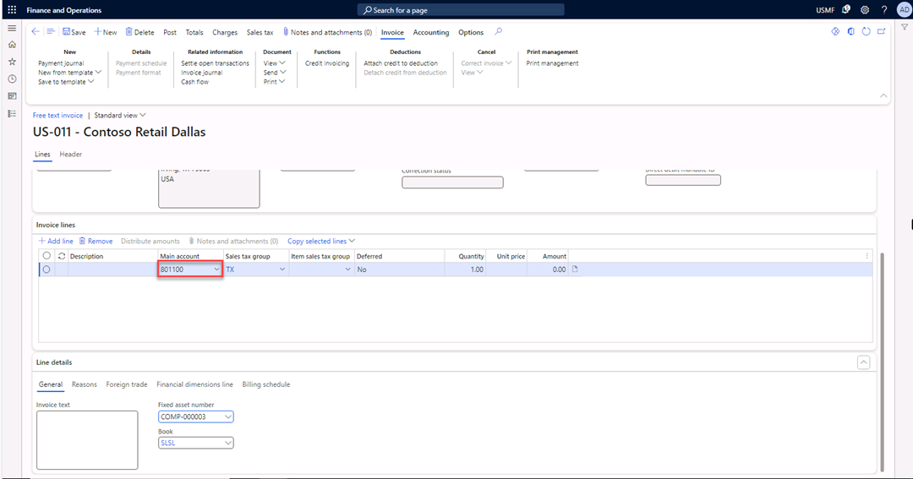

1.  On the **Invoice lines** FastTab, in the **Description** field, enter **LCD
    Monitor**.

2.  In the **Unit price** field, enter **100**.

3.  Select **Post** in the Action Pane.
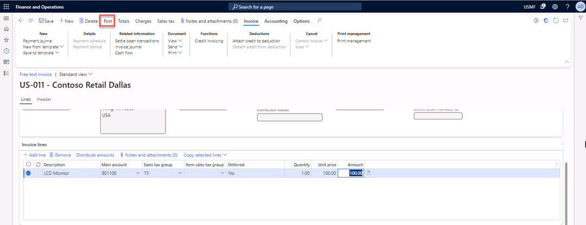

1.  Select **OK** in the **Post free text invoice** pop-up screen.
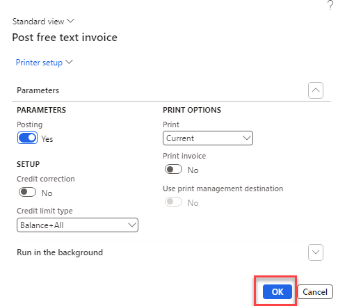

1.  **Close** the form.

## Exercise 3 Review the value of the sold fixed asset

1.  Navigate to **Fixed assets** \> **Fixed assets** \> **Fixed assets** and
    select the fixed asset **COMP-000003**.

2.  Select **Valuations** in the Action Pane.

1.  Check the **Net book value** of the asset. It’s now zero because you sold
    it.
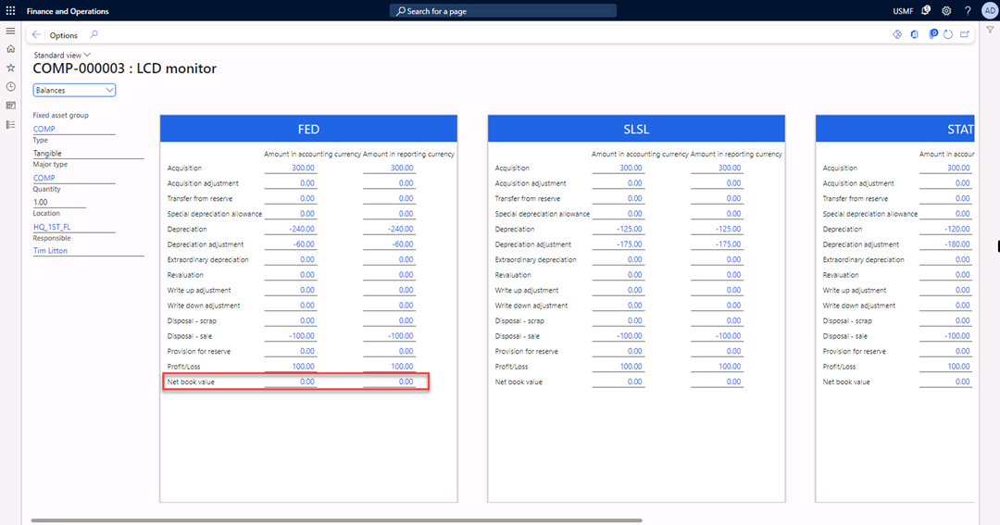

1.  **Close** the form.

## Exercise 4 Set fixed asset parameters

In Finance, you can acquire fixed assets in multiple ways. In this example, you
purchase a fixed asset by using a purchase order. To acquire fixed assets by
using a purchase order, it is important to configure fixed asset parameters.

1.  Navigate to **Fixed assets** \> **Setup** \> **Fixed assets parameters**.

2.  Expand the **Purchase orders** FastTab.

3.  Switch **Allow asset acquisition from Purchasing** to **Yes**.

4.  Switch **Create asset during product receipt or invoice posting** to
    **Yes**.
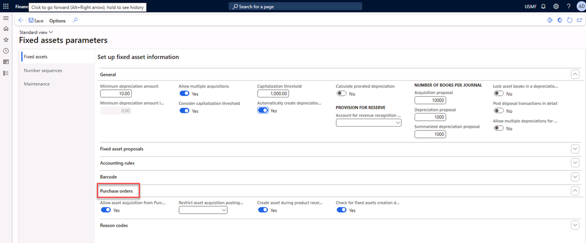

1.  Close the form.

## Exercise 5 Create a new purchase order

1.  Navigate to **Accounts payable** \> **Purchase orders** \> **All purchase
    orders**.

2.  Select **New** in the Action Pane.
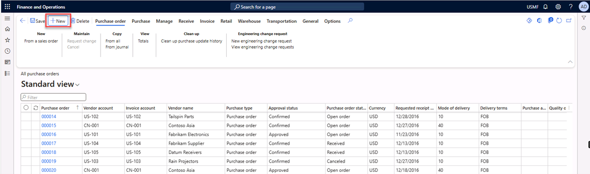

1.  In the **Vendor account** field, select vendor **1001** and select **OK**.
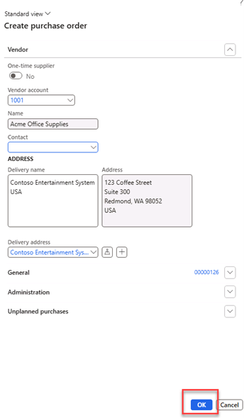

1.  In the **Item number** field, select value **1000**.

2.  In the **Site** field, select value **1**.

3.  In the **Warehouse** field, select **11**.

4.  In the **Quantity** field, select 1.

5.  Select **Save** in the Action Pane.

6.  In the **Line details**, select the **Fixed assets** Tab.

7.  Switch **New Fixed asset**? to **Yes**.

8.  In the **Fixed asset group** field, select **COMP**.
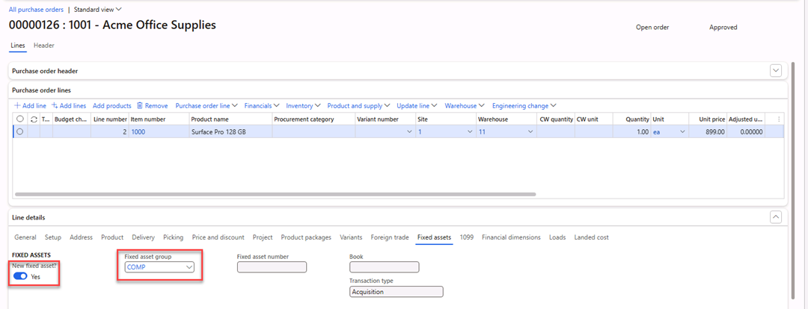

1.  Select **Purchase** in the Action Pane.

2.  Under **Actions**, select **Confirm**.
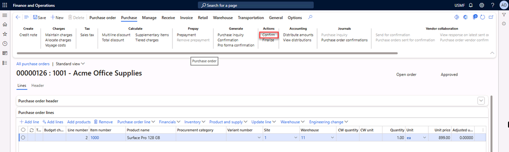

1.  Select **Receive** in the Action Pane.

2.  In the **Generate** section, select **Product receipt**.
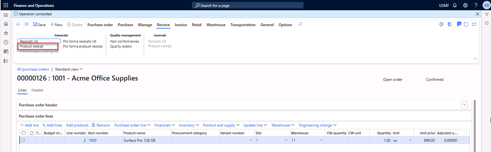

1.  In the **Product receipt** field, enter **1122**.

2.  Select **OK**.

>   The fixed asset will be created and acquired when the product receipt is
>   posted.
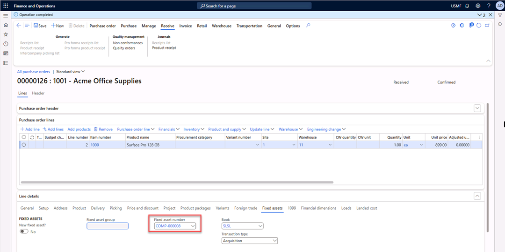

1.  Select **Invoice** in the Action Pane.

2.  In the **Generate** section, select **Invoice**.
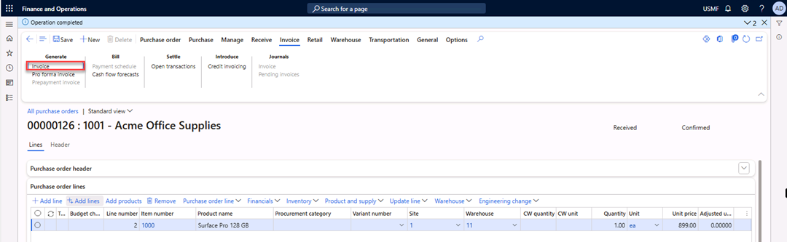

1.  In the **Number** field, enter **4556**.

2.  In the **Invoice description** field, enter **Invoice 4556**.

3.  In the **Invoice date** field, enter **07/11/2024**.

4.  Select **Update match status** in the Action Pane.
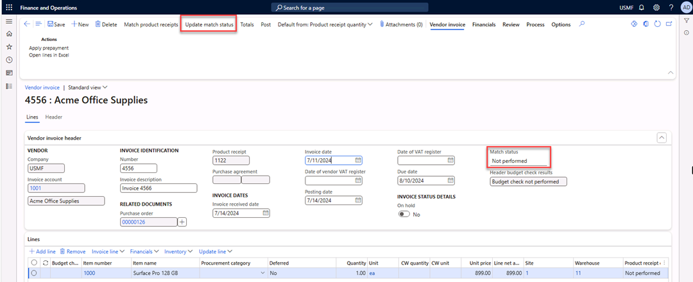
The match status changed to **Passed**.
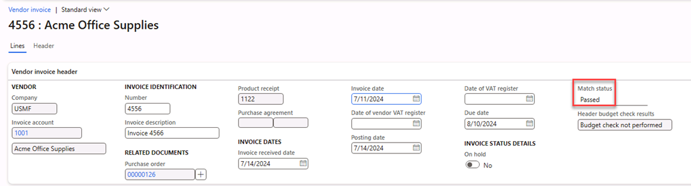

1.  Select **Post** in the Action Pane.
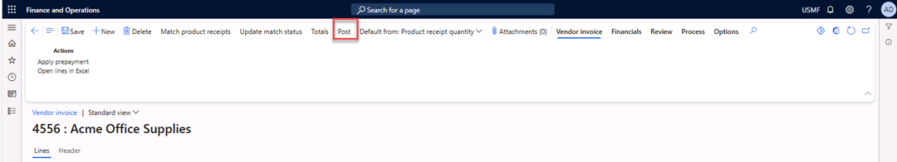

1.  Close the form.

## Exercise 6 Review the value of the purchased fixed assets

1.  Navigate to **Fixed assets** \> **Fixed assets** \> **Fixed assets** and
    select the fixed asset **COMP-000008**.

2.  Select **Valuations** in the Action Pane.
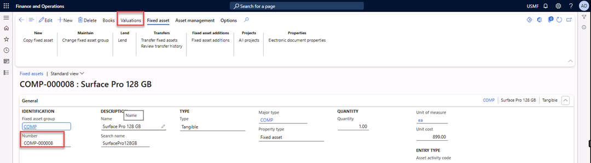

1.  Check the **Acquisition** amount of the asset.
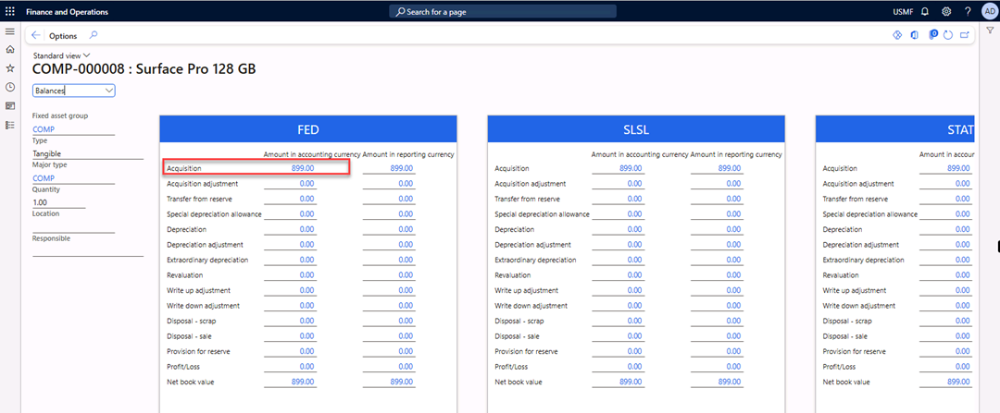

Close the form. You’ve acquired and verified the asset.
