---
lab:
    title: 'Lab: Configure journal name'
    Learning Path: 'LP 1: Set up and configure financial management, and general ledger'
---

# Lab: Configure journal name 

## Objective

The objective of this lab is to create a general journal with various voucher configurations. This lab also practices the approval mechanism of a general journal. 

You will create three general journals in this lab with the following configurations: 

- Single voucher number with no approval 

- Manual voucher number with manual approval process 

- Continuous voucher number with workflow approval process 

1.  Open your **Dynamics 365 Finance** environment and using the **Company picker**, change the legal entity to **USMF**. 

## Exercise 1: Configuring a number sequence 

1.  Navigate to Modules, and **Organization administration > Number sequences > Number sequences**. 

    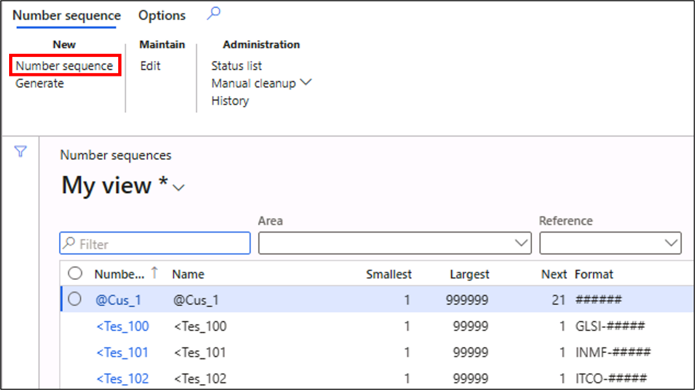

2.  Select **Number sequence** in the action pane and create a new number sequences for the one voucher daily journal: 

    - **Number sequence code**: GenJrn-V-1

    - **Name**: One voucher daily journal 

    - **Scope**: Company

    - **Company**: USMF

    - In the **Segments** FastTab:

		- **Company Value:** leave as **USMF**

		- **Constant Value**: GJV-

		- **Alphanumeric Value**: #########

	- **SETUP > Continuous**: Yes

	- Select the **Save** button in the action pane.

3.  Select the **+New** button in the action pane and create a new number sequence for the manual voucher daily journal: 

	- **Number sequence code**: GenJrn-V-2

	- **Name**: Manual voucher daily journal 

	- **Scope**: Company

	- **Company**: USMF

	- On the **Segments** FastTab:

		- **Company Value:** leave as **USMF** 

		- **Constant**: MJV-

		- **Alphanumeric**: #########

	- **SETUP > Manual**: Yes

	- Select the **Save** button in the action pane.

4.  Select the **+New** button in the action pane and create a new number sequences for the daily journal with continuous voucher:

	- **Number sequence code**: GenJrn-V-3

	- **Name**: Daily journal with continuous voucher

	- **Scope**: Company

	- **Company**: USMF

	- On the **Segments** FastTab:

		- **Company Value:** leave as **USMF** 

		- **Constant**: DJCV-

		- **Alphanumeric**: #########

	- **SETUP > Continuous**: Yes

	- Select the **Save** button in the action pane. 

## Exercise 2: Daily journal with single voucher number

1.  Navigate to **General ledger &gt; Journal setup** and open the **Journal names** page. 

2.  Create a new record by selecting the +**New** button in the action pane, and enter the following values:

    - **Name**: D-OneVouch.

    - In the **Description**: Daily one voucher journal.

    - **General** FastTab: **Journal type**: Daily.

    - **General** FastTab: **VOUCHER NUMBER** section: **Voucher series**: GenJrn-V-1.

    - **General** FastTab: **VOUCHER NUMBER** section: **New** **voucher**: One voucher number only.

3.  Select **Save** in the action pane and close the page.

4.  Navigate to **General ledger &gt; Journal entries** and open the **General journals** page.

5.  Create a new journal by selecting the **+New** button in the action pane. 

6.  In the **Name** field select or enter `D-OneVouch` from the lookup and select the **Lines** button in the action pane. 

7.  Enter the following journal line: 

    - **Voucher (auto-update)**: USMFGJV-0000000 01

    - **Account type**: Ledger

    - **Account**: 601503-002-023

    - **Debit**: 250

    - **Offset account type**: Bank

    - **Offset account**: USMF OPER

8.  Enter another journal line by selecting the **New** button in the toolbar: 

	- **Voucher (auto-update)**:  USMFGJV-0000000 01

	- **Account type**: Ledger

	- **Account**: 110180-002-023

	- **Debit**: 100

	- **Offset account type**: Bank

	- **Offset account**: USMF OPER

9.  You can see that in both the lines the voucher number is the same.

10. You can also see that the **Post** button in the action pane is enabled and the journal is ready for posting. You may post if you like. You may get an error that the period does not exist; this is fine.

## Exercise 3: Daily journal with manual voucher number and manual approval

1.  Navigate to **System administration &gt; Users** > **User groups**. 

2.  Create a new record by selecting the +**New** button. 

3.  In the **Group** column enter: `DailyJrn` 

4.  In the **User group name** column enter: `Daily manual journal approver group`

	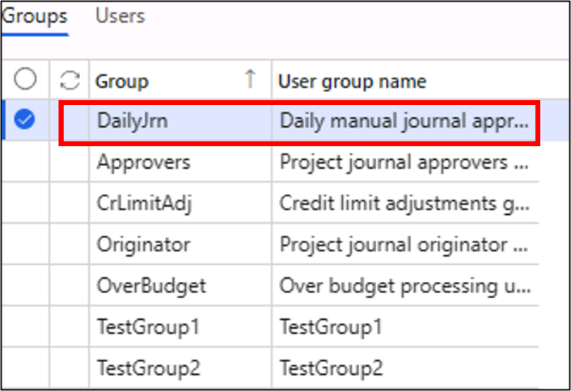

5.  Navigate to the **Users** tab. 

6.  Select **Admin** in the **REMAINING USERS** list and select the ⇾ right arrow to move it to **SELECTED USERS**.

    > **Note:** Your Azure Active Directory users will differ in a live environment.

	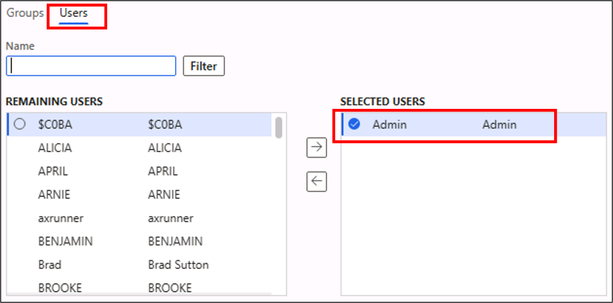

7.  Navigate to **General ledger &gt; Journal setup** > **Journal names**. 

8.  Create a new record by selecting the +**New** button in the action pane, and enter the following values:

	- **Name**: `D-Manual`

	- **Description**: `Daily manual journal with approval`

	- **General** FastTab, **Journal type**: `Daily` 

	- **General** FastTab, **APPROVAL** section, **Active**: Yes 

	- **General** FastTab, **APPROVAL** section, **Approve**: `DailyJrn`

	- **General** FastTab, **VOUCHER NUMBER** section, **Voucher series**: `GenJrn-V-2`

	- **General** FastTab, **VOUCHER NUMBER** section, **New voucher**: `Manual`

9.  Select **Save** in the action pane and close the page. 

10. Navigate to **General ledger &gt; Journal entries** > **General journals**.

11. Create a new journal by selecting the +**New** button in the action pane.

12. In the **Name** field select or enter `D-Manual` from the lookup and select the **Lines** button in the action pane. 

13. Enter the following journal line by selecting the +**New** button or using the provided blank line: 

	- **Voucher**: USMFMJV-000000001

	- **Account type**: Ledger

	- **Account**: 601503-002-023--

	- **Debit**: 250

	- **Offset account type**: Bank

	- **Offset account**: USMF OPER

14. Enter another journal line by selecting the **+New** button in the toolbar: 

	- **Voucher**:  USMFMJV-000000002

	- **Account type**: Ledger

	- **Account**: 110180-002-023

	- **Debit**: 100

	- **Offset account type**: Bank

	- **Offset account**: USMF OPER

15. Note that the **Post** button in the action pane is disabled, but the **Approval** menu in the action pane is enabled. 

16. Under the **Approval** menu in the action pane, select **Report as ready**.

	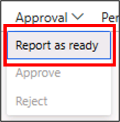

17. The **Approve** and **Reject** button under the **Approval** menu will be enabled. Select the **Approve** button and see that the journal is ready for posting and the **Post** button in the action pane is enabled.

## Exercise 4: Daily journal with continuous voucher number and workflow approval

1.  Navigate to **General ledger &gt; Journal setup** > **General ledger workflows**.

2.  Select the +**New** button to open the **Create workflow** dialog.

	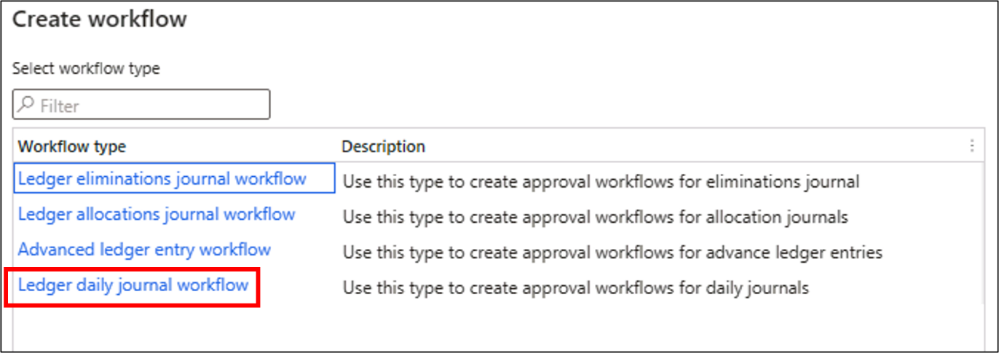

3.  Select **Ledger daily journal workflow** and the system will throw a popup message asking to launch the workflow client. Select **Open**.

    > **Warning:** The workflow designer often **pops under** so, check the taskbar. If the designer does not open, and you are not prompted to run the Microsoft Dynamics 365 Finance: Financial Report Designer and to log in, then restart Microsoft Edge in the lab environment, log in again, and perform steps 1 to 3 again. If it still doesn't work, report to your Authorized Lab Hoster that the workflow editor will not start. 

4.  Once you enter your Dynamics 365 Finance credentials, the workflow client for daily ledger journal will open. 

    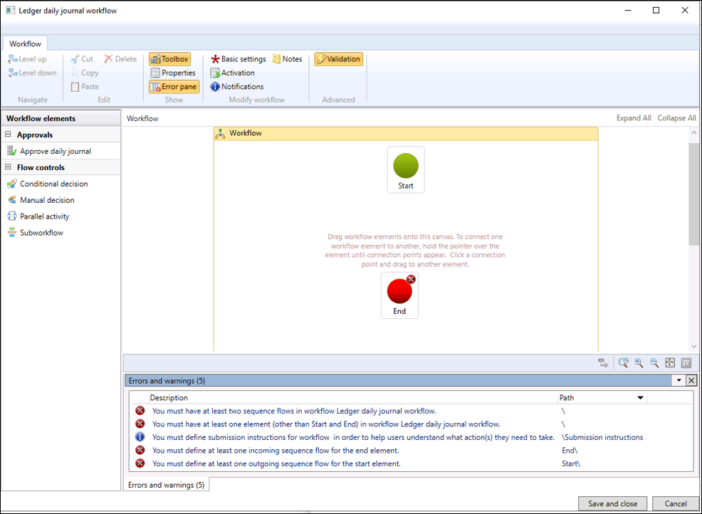 

5.  Drag the **Approve daily journal** workflow element from the left panel and drop it between the **Start** and **End** elements. Connect the three elements.

    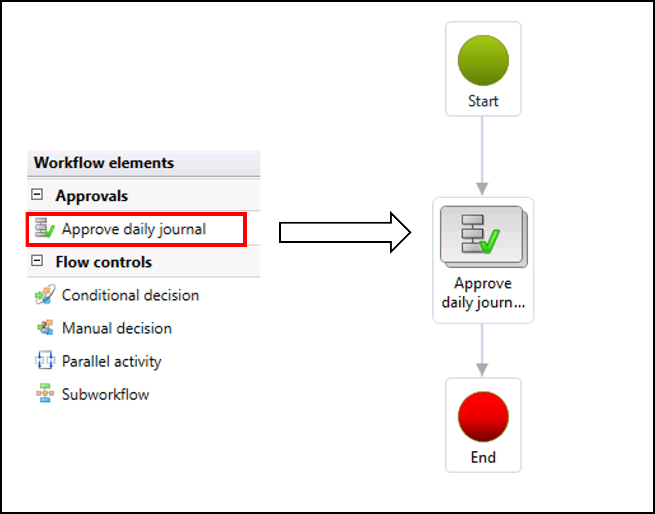

6.  Select the **Approve daily journal** element and select the **Level down** button in the action pane.

7.  Select the **Step 1** element and select the **Basic Settings** button in the action pane.

    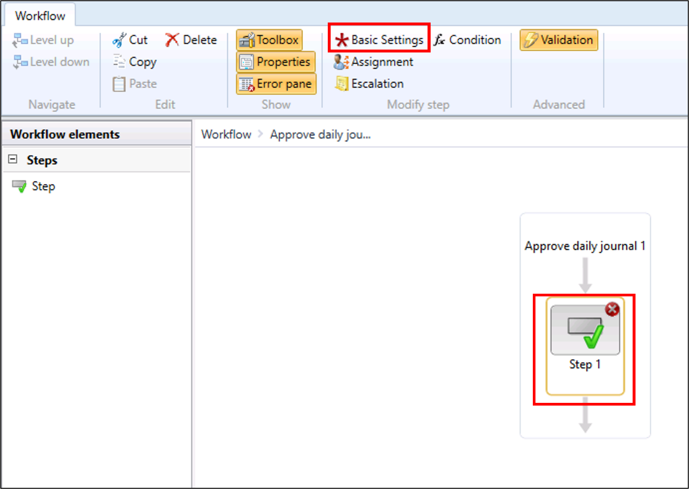

8.  Rename the **Name** of the step to `Approval step`.

9.  In the **Work item subject** field enter: `Daily journal approval`.

10. In the **Work item instructions** field, enter: `Approval request for journal : `

11. In the **Work item instructions** field, select **Insert placeholder** and select **%Ledger journal table.JournalNum%**.

12. Select the **Assignment** tab of the workflow element property window. 

13. Select User as the **Assignment type** and navigate to the **User** tab. 

14. Select the **User ID** Admin from **Available users** and add it into the **Selected users** list. 

    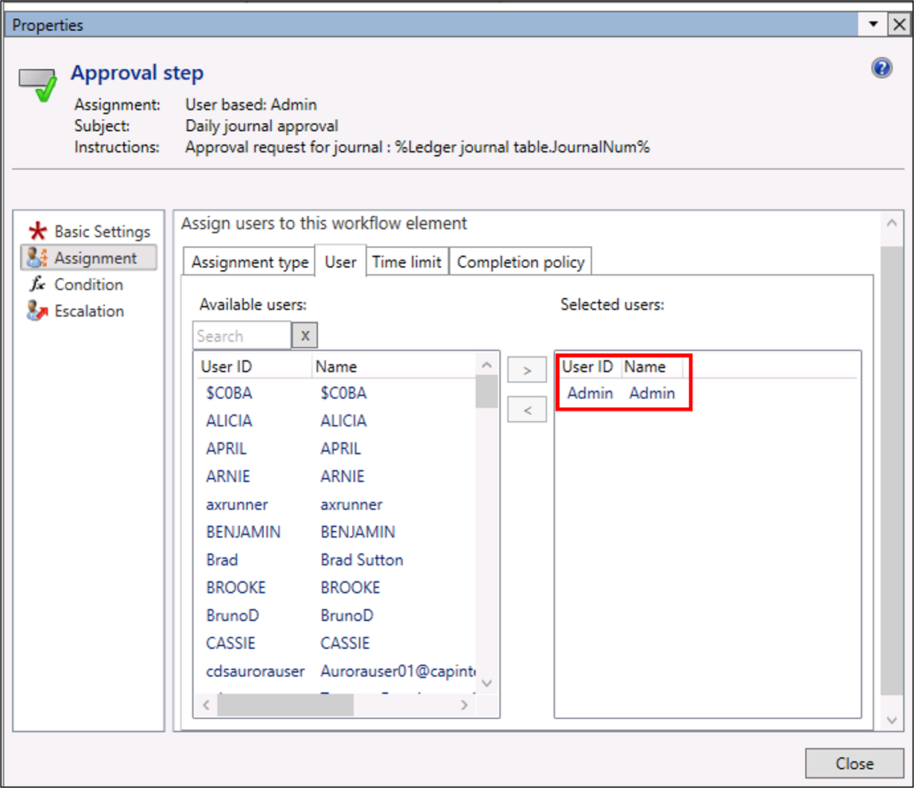 

15. Close the workflow element property window.

16. Select the **Save and close** button of the workflow editor. Optionally enter some **Version notes** and select **OK**.

16. Select **Activate the new version** and select **OK**. 

17. The system will navigate you back to the **General ledger** **workflow** page, where you should find the newly created workflow Note the number.

    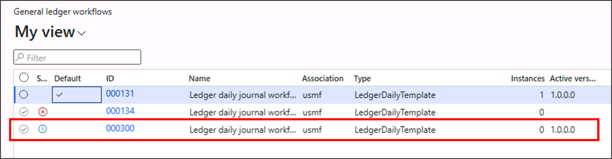

18. Navigate to **General ledger &gt; Journal setup** and open the **Journal names** page.

19. Create a new record by selecting the +**New** button in the action pane.

20. In the **Name** field enter: `D-ContVouc`

21. In the **Description** field enter: `Daily continuous voucher with workflow`

22. In the **General** FastTab, in the **Journal type** field select: Daily

23. In the **General** FastTab and **APPROVAL WORKFLOW** section, in the **Approval workflow** field select: Yes. 

24. In the **General** FastTab and **APPROVAL WORKFLOW** section, in the **Workflow** field select the newly created workflow. 

25. In the **General** FastTab and **VOUCHER NUMBER** section, in the **Voucher series** field select or enter: `GenJrn-V-3`

26. In the **General** FastTab and **VOUCHER NUMBER** section, in the **New voucher** field select: In connection with balance. 

27. Select **Save** in the action pane and close the page.

28. Navigate to **General ledger &gt; Journal entries** and open the **General journals** page.

29. Create a new journal by selecting the +**New** button in the action pane.

30. Select or enter `D-ContVouc` in the **Name** lookup and select the **Lines** button in the action pane.

31. Enter the following journal line:

	- **Voucher (auto-update)**: USMFDJCV-000000001

	- **Account type**: Ledger

	- **Account**: 601503-002-023

	- **Debit**: 250

	- **Offset account type**: Bank

	- **Offset account**: USMF OPER

32. Enter another journal line by selecting the +**New** button in the toolbar: 

    - **Voucher**: USMFDJCV-000000002

    - **Account type**: Ledger

    - **Account**: 110180-002-023

    - **Debit**: 100

    - **Offset account type**: Bank

    - **Offset account**: USMF OPER

    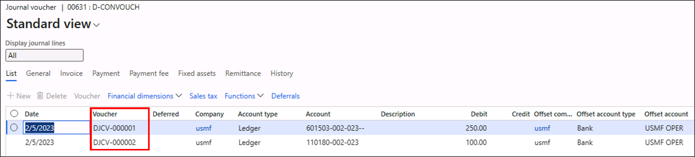

33. You can see that the **Post** button in the action pane is disabled.

34. **Save** and **close** the **journal line** page. In the **General journals** page, you will notice a new **Workflow** button in the action menu.

    > **Note:** The Workflow button may be to the right under the (...) ellipsis menu. 

    

35. Select the **Submit** button to submit the journal for Workflow approval. Depending on the version of your machine, you may get an error around perfoming a budget check for the date, but can still submit.

36. After some time, **refresh** the page. When the Workflow has been assigned to you, select the **Workflow** button again to verify that you get will get more buttons for further workflow actions: reject, request change, delegate, recall, and view history - but this is not necessary for this lab. 

    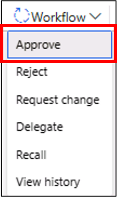

37. You can select the appropriate button to take the workflow process forward. Select the **Approve** button, optionally add a comment. The journal will now be ready for posting and the **Post** button in the action pane will be enabled. 

