---
lab:
    title: 'Lab: Customer collection management'
    module: 'LP 2: Accounts receivable, credit and collections'
---

### Change log

Updated 12Dec2023 Tested against 10.0.37, clarified Ex3

Updated 11Dec2023 Ex3 Steps 16, 17, 18 Renumber

Updated 19Jul2023 Ex2 Step 3 Change text for customer name

Updated 19Jul2023 Ex2 Step 4 Change location of save

Updated 19Jul2023 Ex5 Step 3 Specify order

Updated 19Jul2023 Ex6 Step 1 Correct misspelling

Updated 19Jul2023 Ex6 Step 10 Improve formatting

Updated 19Jul2023 Ex6 Removed yellow checkbox testing

Updated 19Jul2023 Ex11 Step 2 Added date hint

19Jul2023 Tested against 10.0.32

# Lab: Customer collection management

## Objective

In this lab, we will generate an aging report and process a collection letter. 

- In the first scenario, we will create a new payment term for net 3 days. We will also create a new customer. For this customer, we will create a sales order and associate the new payment terms. We will process the entire sales order and generate the invoice. The due date of the invoice will be three days from the current date. We will run the aging report for the new customer. 

-  In the second scenario, we will create another sales order for the new customer, where payment terms will be COD (cash on delivery). We will complete the processing of the sales order and generate the invoice. The due date of the invoice will be the current date. We will run the collection report for the new customer. 

1.  Open your **Dynamics 365 Finance** environment and using the **Company picker**, change the legal entity to **USMF**. 

## Exercise 1: Create a new payment term

1.  Select **Modules** from the navigation pane. In **Accounts receivable**, navigate to **Payments setup** > **Terms of payment**. 

2.  To create a new payment term, select the **+New** button in the action pane. 

3.  Enter this data into the following fields: 

	- **Terms of payment**: `Net3` 

	- **Description**: `Net 3 days` 

	- **Payment method**: `Net` 

	- **Days**: `3` 

4. Select the **Save** button in the action pane and close the page. 

## Exercise 2: Create a new customer

1.  In the **Accounts receivable** module, navigate to **Customers** > **All customers**. 

2.  To create a new customer, select the **+New** button in the action pane. 

3.  In the **Create customer** dialog, enter the following values: 

    - **Customer account**: `Cust-01`

    - **Name**: `Customer 01`

    - **Customer group**: `10`

4.  Select **Save** in the dialog. 

4.  Expand the **Credit and collections** FastTab and change **Exclude from credit management** to **Yes**, so that we can order right away. Select **Save** and close the page. 

## Exercise 3: Create and process a new sales order

1.  In the **Accounts receivable** module, navigate to **Orders** > **All sales orders**. 

2.  Select the **+New** button in the action pane to create a new sales order. 

3.  In the **Create sales order** dialog, enter or select the following values:

    - **Customer account:** `Cust-01`

4.  Select the **OK** button.

5.  In the **Sales order lines** grid, enter the following values: 

    - **Item number**: `1000` 

    - **Quantity**: `1` 

    - **Site**: `1` 

    - **Warehouse**: `13` 

    - **Unit price** (auto-populated): `1900`

    - **Net amount** (auto-populated): `1900`

6.  Select the **Header** tab of the Sales order. Navigate to and expand the **Price and discount** FastTab. In the **Payment** field, enter or select `Net3`.

7.  Select the **Save** button in the action pane to save the sales order.

	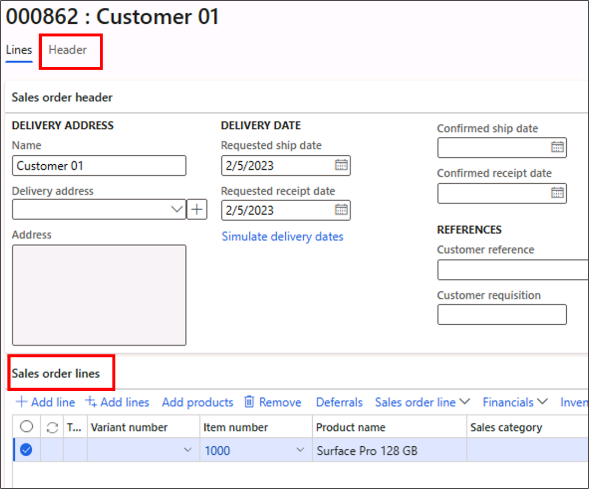

8.  In the action pane, select the **Sell** tab and confirm the sales order by selecting **Confirm sales order** under the **Generate** section. 

9.  In the **Confirm sales order** dialog, select the **OK** button, and **OK** again.

10. In the action pane, select the **Pick and pack** tab, and select **Generate picking list** under the **Generate** section. 

11. In the **Posting picking list** dialog, select the **OK** button, and **OK** again.

12. In the action pane, in the **Pick and pack** tab, select **Picking list registration** under the **Generate** section. 

13. The **Picking list registration** page will open, select the **Updates** button and select **Update all**. Verift that the **Handling status** field in the **Lines** FastTab changes to **Completed**. 

14. Close the **Picking list registration** page and you will be at the sales order you created. 

15. In the action pane, under the **Pick and pack** tab, select **Post packing slip** under the **Generate** section. 

If you get an error during posting, it may be because today's date is not an open date in the current Fiscal period. 

- Open a new tab (we suggest duplicating the current one). 
- Navigate to General Ledger > Ledger setup > Fiscal calendars. 
- Change the Calendar to Fiscal and verify that this year is not listed. 
- Select +New year and Create. 
- You can then return to post your packing slip. 

If this year is listed, then try again to post the packing slip. If the option is not available, it's posted.

16. In the **Packing slip posting** dialog, select the **OK** button, and **OK** again.

17. In the action pane, select the **Invoice** tab, and select **Invoice** under the **Generate** section. 

18. In the **Posting invoice** dialog, select the **OK** button, and **OK** again.

## Exercise 4: Create a Customer pool

1.  In the **Credit and collections** module, navigate to **Setup** > **Customer pools**. 

2.  Select the **+New** button in the action pane to create a new customer pool. 

3.  Add the following values in the fields below:

    - **Pool ID**: `New-aging` 

    - **Pool description**: `New customer aging` 

    - **Pool type**: `Aging snapshot` 

4.  Select the **Select pool criteria** button and update the **Criteria** value for the **Customer account** field with `Cust-01`. Select the **OK** button. 

    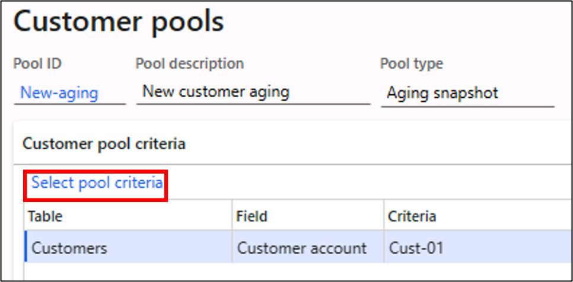
 
5.  Select the **Save** button in the action pane and close the page. 

## Exercise 5: Create an Aging period definition

1.  In the **Credit and collections** module, navigate to **Setup** > **Aging period definitions**. 

2.  Select the **+New** button in the action pane to create a new aging period definition. 

3.  Create a record as shown below:

    - Aging period definition: `7 and 30 days`

    - Description: `after 7/30 days`

    - **Remove** the existing periods and add:
  
    > **Note:** Hint: Start at the bottom (Current) and **Add above**

    | Period  | Unit | Interval  | Aging indicator  |
    |---------|------|-----------|------------------|
    | 30+     | -1   | Unlimited | Red diamond      |
    | 7       | -7   | Day       | Yellow triangle  |
    | Current | 0    | Unlimited | Green check mark |

    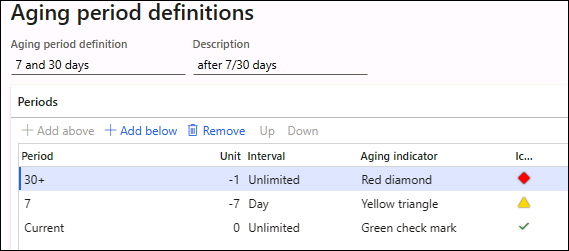

4.  Set the **Printing direction** to be **Backward**. 

5.  Select the **Save** button in the action pane and close the page. 

## Exercise 6: Run aging balance

### Test Red diamond

1.  In the **Credit and collections** module, navigate to **Setup** > **Credit and collections parameters**. 

2.  Under the **Collections** tab, expand the **Collections defaults** section, enter or select the value `7 and 30 days` in the **Aging period definition** field. 

3.  Save the record by selecting the **Save** button in the action pane and close the page.

4.  Navigate to **Credit and collections &gt; Periodic tasks** > **Age customer balances**.

5.  In the **Create a customer aging snapshot** dialog, enter the following values:

	- **Aging period definition**: `7 and 30 days`

	- **Pool ID**: `New-aging`

	- **Criteria**: `Due date`

	- **Aging as of**: `Selected date`

	- In the **Selected date** field, select a date more than 30 days ahead of the current date. 

	- **Update collection status**: Yes

	- **Include customers with zero balance**: Yes
 
	- **Bypass credit limit calculations during aging**: No **Note:** This may not be an option, depending on your version.

	- **Batch processing** (under Run in the background): No

6.  Select the **OK** button. 

7.  Navigate to **Credit and collections &gt; Collections** > **Aged balances**. 

8.  You should see an aging status for **Customer 01** with a red diamond, and 1,900.00 in the **30**+ bucket. 

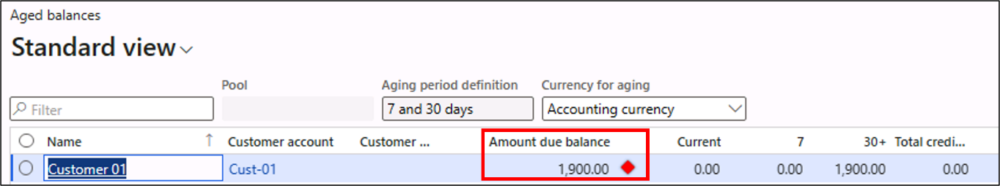

(If you don't, are you sure you invoiced? Exercise 3 step 17.)

<!---

### Test Yellow triangle

9.  Navigate back to **Credit and collections &gt; Periodic tasks** > **Age customer balances**.

10.  In the **Create a customer aging snapshot** dialog, enter the following values:

   - **Aging period definition**: `7 and 30 days`
    
   - **Pool ID**: `New-aging`

   - **Criteria**: `Due date`

   - **Aging as of**: `Selected date`

   - In the **Selected date** field, select a date less than 30 days and more than 7 days ahead of your current date

   - **Update collections status**: Yes

   - **Include customers with zero balance**: Yes
 
   - **Bypass credit limit calculations during aging**: No (if available)

   - **Batch processing** (under Run in the background): No

11. Select **OK**. 

12. Navigate to **Credit and collections &gt; Collections** > **Aged balances**. 

13. You should see an aging status for **Customer 01** with a yellow triangle, and 1,900.00 in the **7** bucket. 

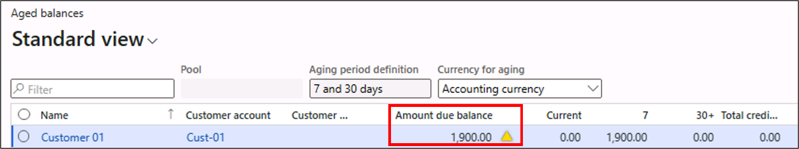

-->

### Test Green checkmark

9. Navigate back to **Credit and collections &gt; Periodic tasks** > **Age customer balances**.

10. In the **Create a customer aging snapshot** dialog, enter the following values and select the **OK** button:

	- **Aging period definition**: `7 and 30 days`

	- **Pool ID**: `New-aging`

	- **Criteria**: `Due date`

	- **Aging as of**: `Selected date`

	- In the **selected date** field, select a date less than 7 days ahead of your current date.

	- **Update collection status**: Yes

	- **Include customers with zero balance**: Yes

	- **Bypass credit limit calculations during aging**: No (if available)

	- **Batch processing**: No

11. Navigate to **Credit and collections &gt; Collections** > **Aged balances**.

12. You should see an aging status for **Customer 01** with a green checkmark, and 1,900.00 in the **Current** bucket. 

    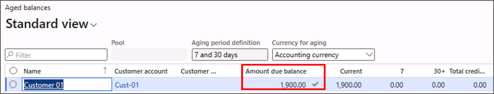

## Exercise 7: Setup collection letter sequence

1.  In the **Credit and collections** module, navigate to **Collection letter** > **Set up collection letter sequence**. 

2.  Select the **+New** button in the action pane and create a collection letter sequence as below: 

	- Collection letter sequence: `Medium` 

	- Description: `Medium priority` 

	- Lines: 

    | Collection letter code | Description           | Main account | Fee in currency | Minimum overdue balance | Days | Block     |
    |------------------------|-----------------------|--------------|-----------------|-------------------------|------|-----------|
    | `Collection letter 1`  | `First notification`  |              | 0.00            | 0.00                    | `1`  |           |
    | `Collection letter 2`  | `Second notification` | `403150`     | `25.00`         | `100.00`                | `3`  |           |
    | `Collection`           | `Final notification`  | `403150`     | `50.00`         | `100.00`                | `7`  | (checked) |

	- Add a note to the first notification saying `Hello, this is the first reminder for paying your balance.` 

	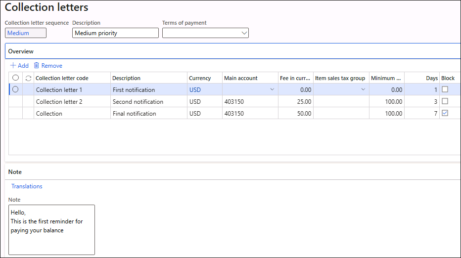

3.  Select the **Save** button in the action pane and close the page. 

## Exercise 8: Create an interest code

1.  In the **Credit and collections** module, navigate to **Interest** > **Set up interest codes**. 

2.  Select the **+New** button in the action pane and create an interest code. 

3.  Enter the following values in the **interest code** page:

	- Interest code: `7D-1.5%`

	- Description: `1.5% after 7 days`

	- Interest type: `Single rate`

	- Grace period: `0`

	- Effective: 2/5/2023

	- Expiration: Never

    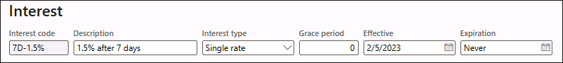

4.  Expand the **Earnings** FastTab and enter the following values:.

    - Calculate interest every: `1`

    - Ledger posting account: `700200` 

    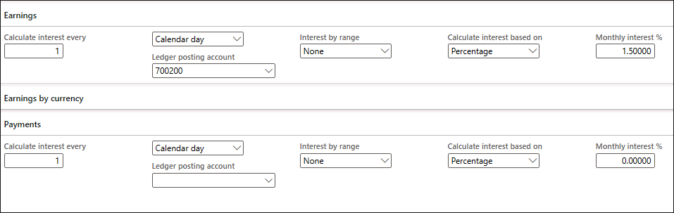

5. Select the **Save** button in the action pane and close the page.

## Exercise 9: Configure the Customer posting profile

1.  Navigate to **Credit and collections &gt; Setup** > **Customer posting profiles**.

2.  Select the existing **GEN** record and select the **Add** button in the **Setup** FastTab. 

3.  Add a new record and enter values as shown below:

    - **Account code**: `Table`

    - **Account/Group number**: `Cust-01`

    - **Summary account**: `133300`

    - **Collection letter sequence**: `Medium`

    - **Interest code**: `7D-1.5%`

	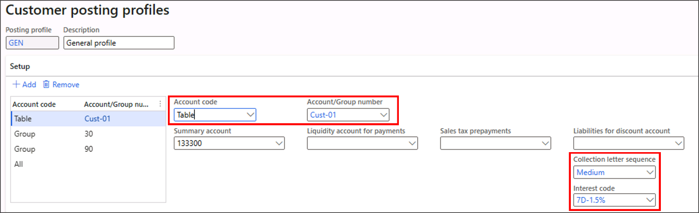

4.  Select the **Save** button in the action pane and close the page.

## Exercise 10: Create and process a new sales order

1.  Navigate to **Accounts receivable &gt; Orders** > **All sales orders**.

2.  Select the **+New** button in the action pane to create a new sales order.

3.  In the **Create sales order** dialog, enter `Cust-01` for the **Customer account** and select the **OK** button.
  
4.  In the **Sales order** lines, enter the following values: 

    - **Item number**: `1000` 

    - **Quantity**: `1` 

    - **Site**: `1` 

    - **Warehouse**: `13` 

    - **Unit price** (auto-populated): 1900 

    - **Net amount** (auto-populated): 1900 

5.  Select the **Header** tab of the Sales order and navigate to the **Price and discount** FastTab. In the **Payment field**, enter or select `COD`. 

6.  Navigate to and expand the **Delivery** FastTab. In the **Mode of delivery** field, enter or select `Truck-Truc`. 

7.  Select the **Save** button in the action pane and save the sales order. Select **OK** to update the order lines. 

8.  In the action pane, select the **Sell** tab and confirm the sales order by selecting **Confirm sales order** in the **Generate** section. 

9.  In the **Confirm sales order** dialog, select **OK** and **OK** again. 

10. In the action pane, select the **Pick and pack** tab, followed by selecting **Generate picking list** under **Generate**. 

11. In the **Posting picking list** dialog, select **OK** and **OK** again. 

12. In the action pane, under the **Pick and pack** button, select **Picking list registration** in the **Generate** section. 

13. The **Picking list registration** page will open, select **Updates** > **Update all** in the action menu. Verify the **Handling status** field in the **Lines** FastTab changes from **Activated** to **Completed**. 

14. Close the **Picking list registration** page and you will be back in the **Sales order** record. 

15. In the action pane, under the **Pick and pack** button, select **Post Packing slip** in the **Generate** section. 

16. In the **Packing slip posting** dialog, select **OK**, and **OK** again. 

17. In the action pane, select the **Invoice** tab, followed by selecting **Invoice** in the **Generate** section. 

18. In the **Posting invoice** dialog, select **OK**, and **OK** again. 

19. In the action pane, select the **Invoice** tab, select **Open transactions** in the **Settle** section. 

    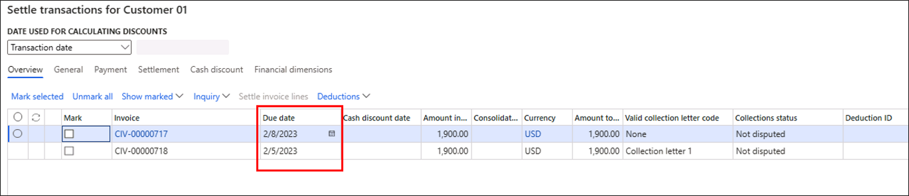 

20. You will find two open invoices for settlement: 

    - The first one with a due date three days from the current date. 

    - The second one with the current date as the due date. 

21. Select **OK**. 

## Exercise 11: Create a collection letter 

1.  In the **Credit and collections** module, navigate to **Collection letter** > **Create collection letters**. 

2.  A dialog will pop up to run the collection letter process. Add the following parameters in the **Creation of collection letter** dialog: 

    - **Invoice**: Yes

    - **Collection letter**: `Collection letter 1` 

    - **Collection letter date**: Current date + 1 day (Tomorrow)

    > **Note:** Hint: Use the system date on the environment, not your own current date

    - **Use posting profile from**: `Account` 

    - **Posting profile**: `GEN` 

    - Select the **Filter** option, enter `Cust-01` for the **Customer account**, **Criteria** and select **OK**. 

    - **Batch processing** (in the **Run in the background** section): **No** 

    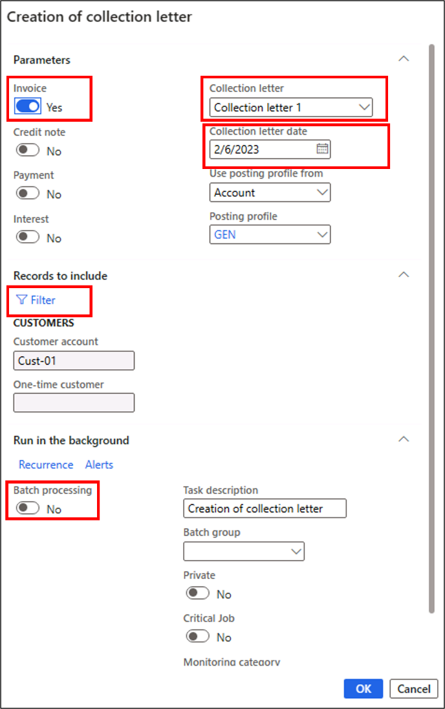 

3.  Select the **OK** button to execute the collection letter creation process. 

4.  In the **Credit and collections** module, navigate to **Collection letter** > **Review and process collection letters**. 

5.  Select the **Collection letter** column header and select **Sort Z to A**. You will see the **Collection letter** has been created notifying the customer that payment is requested for the overdue invoice. 

    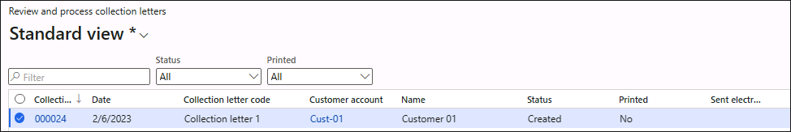

6.  You can post the collection letter by selecting it in the grid and selecting the **Post** button in the action pane. Select **OK**. 

