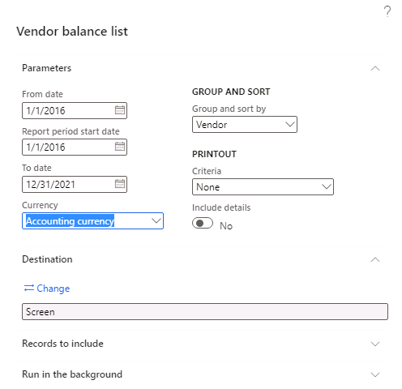
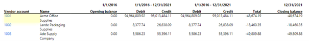
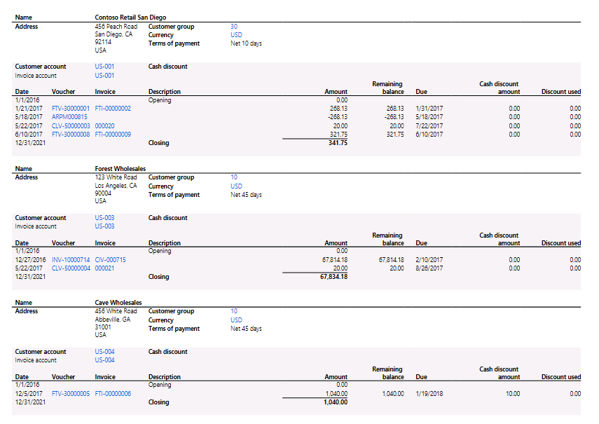
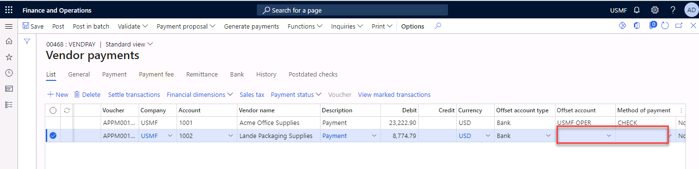
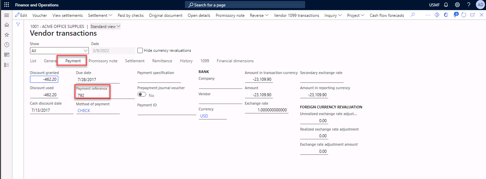
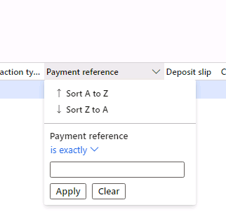

---
lab:
    title: 'Lab: Create and post vendor, customer, general ledger payments'
    module: 'Module 2: Set up and configure financial management'
---

# Lab - Create and post vendor, customer, general ledger payments

Heather, the bookkeeper at Contoso, must post a bank statement manually. Two customers paid an invoice, Heather needs to post payments to two vendors, and she also needs to post on main account 605160 for costs which are costs paid directly from the bank. If there are many bank transactions on a bank statement, these are normally imported. 

Due to the **segregation of duties,** Heather needs to post the vendor invoices from the module Accounts Payable, the customer invoices are posted from the Accounts receivable module, and costs paid directly from the bank should be posted in a general journal.

 

## Exercise 1:Determine open transaction Vendors

First, we need to find an open transaction for a vendor. 

1. Navigate to **Accounts payable** > **Inquiries and reports** > **Vendor reports** > **Vendor** **balance list** (This is a randomly chosen report, there are more reports that give a similar result).

2. Type **01/01/2016** in the field From date

3. Type **01/01/2016** in the field Report period start date

4. Type to date **12/31/2021.**

5. Select **OK**
	

	We will see the following open transactions (total amounts) for Vendor 1002 and 1002. (If your report comes out completely blank, then it may be a result of the **Feature management** setting for **Report PDF viewer**. Simply select Export from the Action menu and select PDF. Open file and you will see the results.) Heather will pay the two Vendors by bank. 

	Vendor 1001-48,674.19

	Vendor 1002-18,460.35

	

	Note the Vendors. 

 

## Exercise 2:Determine open transaction Customers 
 
We will do the same for the customers.

1. Navigate to **Accounts Receivable** > **Inquiries and reports** > **Customers** > **Customer account statement (internal).** (This is a randomly chosen report, there are more reports that give a similar result).
 

2. Type **01/01/2016** in the from date field.

3. Type **12/31/2021** in the to date field.

4. Set the field Only open to **Yes** and select OK.
	
	

	Customers account statement (internal), both Customers paid their open transaction to Contoso. 

	US-001341.75

	US-00367,834.18

 
## Exercise 3: Create vendor payment journal

1. Navigate to **Accounts Payable** > **Payments** > **Vendor payment journal**.

2. Select **New** to create a new journal.

3. Select the journal **VendPay** in the name field.

4. **Navigate** to Lines in the Action Pane.

5. **Navigate** to the account field and select Vendor 1001.

6. **Navigate** to the description field and type Payment.

7. **Navigate** to **Settle transactions** (the blue functionality above the lines) If you have chosen a vendor, you will only see the open transactions of that vendor. If you do not select a vendor, you will see all open posts.

8. Select the following lines by checking the box **Mark**

	| Invoice| Due date| Cash discount date| Amount| Currency| Amount to settle| Amount to settle in USD |
	| - | -| - | -| -| -| - |
	| 10017| 7/30/2017| 7/10/2017| 578.09| USD| -575.20| -575.20 |
	| 10012| 7/28/2017| 7/13/2017| 23,109.90| USD| -22,647.70| -22,647.70 |
	| **TOTAL**| | | | | | -23,222.90 |

	Select OK and you will return to the vendor payment journal lines. 

9. **Add** a new line.

10. **Navigate** to the account field and select Vendor 1002.

11. **Navigate** to the description field and type Payment.

12. **Navigate** to **Settle transactions** (the blue functionality above the lines) If you have chosen a vendor, you will only see the open transactions of that vendor. If you do not select a vendor, you will see all open posts.

13. Select the following lines by checking the box **Mark**

| Invoice| Due date| Cash discount date| Amount| Currency| Amount to settle| Amount to settle in USD |
| - | -| - | -| -| -| - |
| 1002809| 7/29/2017| 7/14/2017| 4,536.89| USD| -4,446,15| -4,446,15 |
| 7919| 7/15/217| 7/5/2017| 4,509.00| USD| -4,328.64| -4,328.64 |
| **TOTAL**| | | | | | **-8,774.79** |

Select OK and you will return to the vendor payment journal lines. 

 
14. **Navigate** to the Offset account and make sure **USMF OPER** is selected for both lines, and if not, select **USMF** **OPER** in the field Offset account. 

15. **Navigate** to the Method of Payment field and make sure **CHECK** is selected for both lines, and if not, select **CHECK** in the field Method of payment. 

16. Select **Generate payments** in the Action pane. 

17. Select **CHECK** in the field Method of payment.

18. Select **USMF OPER** in the field Bank account.

19. Select **OK**.

20. **Note** the number which is shown in the field From (e.g. 792)

21. Select **OK** in the screen **Payment by check** and the process will start (in the background, the checks will be generated).  

22. The error **Unable to find printer with path** will appear. **Close** the message, you will be able to continue the exercise.

23. Check the payment status of the payment, if the status is **Sent**, you can **post** the journal. The check number will display.

## Exercise 4: Create customer payment journal

1. Navigate to **Accounts Receivable** > **Payments** > **Customer payment journal**.

2. Select **New** to create a new journal.

3. Select the journal **CustPay** in the name field.

4. Navigate to **Enter customer payments** in the Action Pane.

5. **Navigate** to the Customer field and select Customer US-001.

6. Navigate to the amount field and type **341.75**

7. The open transactions of customer US-001 will appear in the bottom screen. **Select** the following lines by enabling the Mark box. 

	| Transaction identifier| Identifier type| Due date| Amount available to pay| Currency| Cash discount| Amount to pay |
	| - | - | - | -| -| - | - |
	| FTI-00000009| Invoice| 6/10/2017| 321.75| USD| 0| 321.75 |
	| 000020| Collection letter| 7/22/2017| 20.00| USD| 0| 20.00 |
	| **TOTAL**| | | | | | **341.75** |

8. Navigate to **Save** in journal in the Action pane. 

9. Navigate to the Customer field and select Customer **US-003**.

10. Navigate to the amount field and type **67,834.18**

11. The open transactions of customer US-003 will appear in the bottom screen. **Select** the following lines by enabling the Mark box.

| Transaction identifier| Identifier type| Due date| Amount available to pay| Currency| Cash discount| Amount to pay |
| - | - | - | - | - | - | - |
| CIV-000715| Invoice| 2/10/2017| 67,814.18| USD| 0| 67,814.18 |
| 000021| Collection letter| 8/26/2017| 20.00| USD| 0| 20.00 |
| **TOTAL**| | | | | | **67,834.18** |

12. Navigate to **Save** in journal in the Action pane. 

13. **Close** the form, you will return to the journal header. 

14. **Post** the journal. 

## Exercise 5: Create journal for costs paid directly from the bank

1. Navigate to **General Ledger** > **Journal entries** > **General journals**.

2. Select **New** to create a new journal.

3. Select the journal **GenJrn** in the name field.

4. Navigate to Lines in the Action pane. 

5. Navigate to the field **Account** and select main account **605160**, business unit **001**, department **024**. 

6. Type **electricity costs** in the description field.

7. Type **1,200** in the DEBIT amount field. 

8. Select **Bank** in the Offset account field. 

9. Select **USMF OPER** in the offset account field. 

10. **Post** the journal.

## Exercise 6: Check postings on the bank account

1. Navigate to **Cash and Bank management** > **Inquiries and Reports** > **Bank transactions.**

2. Select **USMF OPER** in the field Bank account criteria.

3. Select **OK**.

4. In the list that is generated, at the top, you will see the general ledger posting and the customer payments posting. The vendor payments are shown as well, but with another date (check date). You can use a filter (for example the payment reference), to show the payments to the vendors.

5. Navigate to **Accounts Payable** > **Vendors** > **All vendors.**

6. Select Vendor **1001** (select the link). 

7. Navigate to tab **Vendor** in the action pane.

8. Navigate to section **Transactions**.

9. Select **Transactions**.

10. Select **invoice 10012** (we paid this invoice) not BY SELECTING the link, but by selecting the field before the voucher number APIN00004. 

11. Under the field **SHOW** you will **see** a ribbon with different functionalities: List, General, Payment, Promissory note, Settlement, Remittance etc. 

12. Select **Payment**.

13. In the second column you will see **Payment reference**. Note the value and use it to filter in the bank transactions. The value is the value you wrote down in exercise 3 – line 8. (f.e. 792). If the field is empty, make sure you posted the journal in exercise 3. 

14. Navigate to **Cash and Bank management** > **Inquiries and Reports** > **Bank Accounts** > **Bank transactions.**

15. Select **USMF OPER** in the field Bank account criteria.

16. Select **OK**.

17. In the list that is generated, navigate to the column **Payment reference** and select the column. 

18. Select the header of the column Payment reference, the field's to filter appears. 

19. Fill in **Payment reference** **is exactly 792.**

20. **Apply** the filter.

21. Only one line is shown, this means that the payment to the vendor is also included in the bank transactions and is therefore paid. (If you do not find it, go back to Exercise 3 and Post it.)

