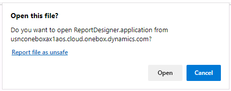
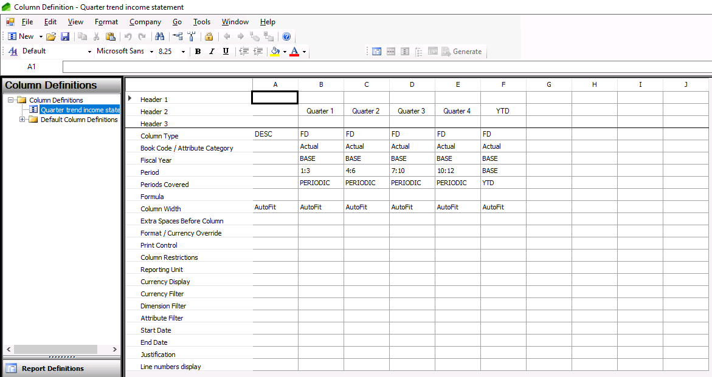
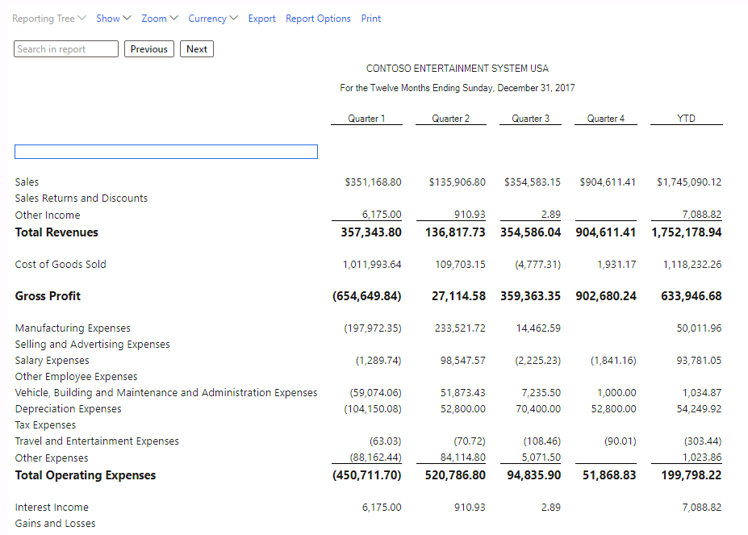
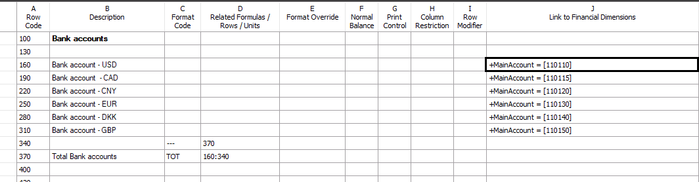
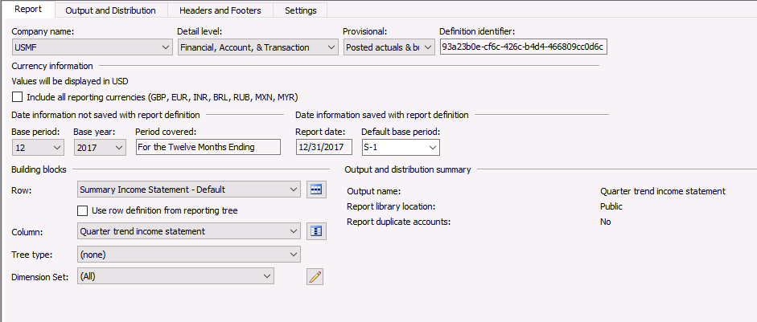
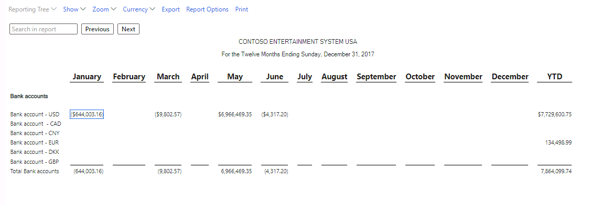

---
lab:
    title: 'Lab: Configure financial reports'
    module: 'Module 2: Set up and configure financial management'
---

## Lab Configure financial reports

Financial reporting provides 22 default financial reports. Every report uses the default main account categories. You can use these reports as is or as a starting point for your financial reporting needs. A report definition includes the following building blocks:

- Row definition

- Column definition

- Optional reporting tree

After you define row definitions and column definitions, you must combine them in a report definition. A report definition includes options and settings that you can use to customize the report. At this point, you also define other aspects of the definitions, such as the detail level and report date. You can then save and generate a report. Financial reporting offers the following levels of detail:

- Financial

- Financial and Account

- Financial, Account, and Transaction

In this lab, you will create the following reports:

- Quarter Trend Income Statement - Default

- Total amounts of all bank accounts per month.

This lab uses the **USMF** demo company.

## Exercise 1: Generate a basic financial report

In this exercise you will review an existing report so you can use the report as the basis for a new report. 

1. Navigate to **General Ledger**, select **Inquiries and reports**, and then select **Financial reports**.

2. Select the **12 Month Trend Income Statement – Default** report.

3. Select **Generate** in the Action Pane.

4. Enter 12/31/2017 in Report date.

5. Select **OK**. The following message displays: The financial report will be generated while you continue to work.

6. Wait a few moments and then select the **Refresh** button. The report should be listed in the Reports section.

7. Select the report and then select **View**. The report displays.   
Notes:   
	- Row definition: You can see the classification of the various main accounts (For example, Sales, Sales returns and Discounts, and Other income).

	- Column definition: You can see one column for each month and one column with the Year to date amounts. 

8. Close the report.

9. Close the form Financial reports.

## Exercise 2 Create a new column definition

In this exercise, you will start with the report that you reviewed in exercise one and modify the report to use five columns, one column for each quarter and one column that displays YTD amounts. 

1. Navigate to **General Ledger**, select **Inquiries and reports**, and then select **Financial reports.**

2. Select **New** in the Action Pane. A report designer program downloads to your device from usnconeboxax1aos.cloud.onebox.dynamics.com. 

3. A confirmation dialog displays. Select **OPEN**. If it prompts you to run the application, select Run.  

4. Sign into the report designer by using the same credentials you use for Dynamics 365 Finance.

5. Select **New** in the ribbon and select **Column definition**. You can use the following keyboard shortcut: Ctrl-Shift-C)

6. Use the values from the table below to design the report.

	| | **A**| **B**| **C**| **D**| **E**| **F** |
	| - | - | - | - | - | -| - |
	| **Header 1**| | | | | |  |
	| **Header 2**| | Quarter 1| Quarter 2| Quarter 3| Quarter 4| YTD |
	| **Header 3**| | | | | |  |
	| **Column Type**| DESC (Row descriptions)| FD (amounts from Financial Dimensions)| FD| FD| FD| FD |
	| **Book code / Attribute category**| | Actual (actual amounts)| Actual| Actual| Actual| Actual |
	| **Fiscal year**| | BASE| BASE| BASE| BASE| BASE |
	| **Period**| | 1:3 (month 1 until month 3)| 4:6| 7:9| 10:12| BASE |
	| **Periods Covered**| | PERIODIC (Specify financial data information for columns of the **FD** type)| PERIODIC| PERIODIC| PERIODIC| YTD |
	| **Formula**| | | | | |  |
	| **Column width**| Autofit| Autofit| Autofit| Autofit| Autofit| Autofit |

	

 

10. Select **Save**. 

11. Enter **Quarter trend income statement** in both the Name field and the Description field and select OK.

12. **Close** the application.

## Exercise 3 Create a new report definition

In this exercise you will define a new report that uses the column definition you created in exercise 2.

1. Navigate to **General Ledger**, select **Inquiries and reports**, and then select **Financial reports**.

2. Select **New** in the Action Pane. A report designer program downloads to your device from usnconeboxax1aos.cloud.onebox.dynamics.com. 

3. Select **OPEN**.

4. Sign into the report designer by using the same credentials you use for Dynamics 365 Finance.

5. Select **New** in the ribbon and then select **Report definition**. You can use the following keyboard shortcut: Ctrl-Shift-P

6. Select **USMF** as the company name.

7. Select **Financial, Account, &amp; Transaction** in the detail level field. 

8. Select **12** for the base period field and **2017** for the Base year field.

9. Select **Summary Income Statement – Default** in the **row** definition field. 

10. Select **Quarter trend income statement** (see exercise 2) in the Column definition field. 

11. Select **Save**.

12. Enter **Quarter trend income statement** in the Name field.

13. Enter **Quarter trend income statement** in the Description field.

14. Close the form.

 

15. **Return** to Dynamics 365 Finance.

16. Navigate to **General Ledger**, select **Inquiries and reports**, and then select **Financial reports**. The new report displays at the top of the list.

17. Select **Generate** in the Action Pane.

18. Select **OK**. The following message displays: The financial report will be generated while you continue to work.

19. Wait a few moments and then select the **Refresh** button. The report should be listed in the Reports section. 

20. Select the report and the select **View**. The report displays.

21. Close the report.

## Exercise 4 Work with row definitions

### Task 1 Create row definitions

1. Navigate to **General Ledger**, select **Inquiries and reports**, and select **Financial reports**.

2. Select **New** in the Action Pane. A report designer program downloads to your device from usnconeboxax1aos.cloud.onebox.dynamics.com. 

3. Select **OPEN**.

4. Sign into the report designer by using the same credentials you use for Dynamics 365 Finance.

5. Select **New** in the ribbon and then select **Row definition**. You can use the following keyboard shortcut: Ctrl-Shift-R

6. Enter **Bank accounts** in line 100, Column B. 

7. Enter **Bank account - USD** in line 160, Column B.

8. Navigate to Column J, **Link to Financial Dimensions**. Select the field to display that lists all the dimensions in a separate column. You may need to make the columns wider to see the content. (Tip: Double-click the box, or select the ellipsis, then select the pencil.)

9. Select **New** to create a new dimension set.

10. Enter **Main Account** in the Name field. 

11. Enter **Main Account** in the Description field. 

12. Select **Main account** in the available fields and select the arrow which points to the **Included item** table.

13. Select **OK.**

14. Close the form. 

15. Navigate to the selection field left of the pencil icon and select the **Main Account** dimension set.

16. Select **OK.**

17. Double-click the Link to financial dimension field again. Main account is the only visible dimension now, or select the drop down by All and select Main account.

18. Double-click Main account and select only account **110110** in the From field.

19. Select **OK** (twice, if necessary) to return to the row definition. 

20. Repeat steps 5-19 to define additional rows using the following information:   

| **Line**| **Column**| **Bank account**| **Main account** |
| - | -| -| - |
| 190| B| CAD| 110115 |
| 220| B| CNY| 110120 |
| 250| B| EUR| 110130 |
| 280| B| DKK| 110140 |
| 310| B| GBP| 110150 |

 

### Task 2 Modify row definitions

1. Navigate to line 340, Column C and select the field **Underscore amounts** (---).

2. Navigate to line 340, Column D and enter the line number where totals will be displayed. In the example above this is line 370. Enter **370**.

3. **Navigate** to line 370, Column B and type **Total bank accounts.**

4. **Navigate** to line 370, Column C and select **Total of other rows** (TOT).

5. **Navigate** to line 370, Column D and type **160:340** (The total of line from 160 to 340).

6. Select **save** (icon).

7. Type **Bank total per month** in the name field.

8. Type **Bank total per month** in the description field. 

9. Select **OK**.

10. Close the form.

11. Close the application.

## Exercise 5 Create a new report definition

1. Navigate to **General Ledger**, select **Inquiries and reports**, and then select **Financial reports**.

2. Select **New** in the Action Pane. A report designer program downloads to your device from usnconeboxax1aos.cloud.onebox.dynamics.com. 

3. Select **OPEN**.

4. Sign into the report designer by using the same credentials you use for Dynamics 365 Finance.

5. Select **New** in the ribbon and then select **Report definition**. You can use the following keyboard shortcut: Ctrl-Shift-P

6. Select **USMF** as the company name.

7. Select **Financial, Account, &amp; Transaction** in the detail level field. 

8. Select **12** for the base period field and **2017** for the Base year field.

9. Select **Bank total per month** in the row definition field. 

10. Select **12 Month Periodic trend - default** in the Column definition field. 

11. Select **Save**.

12. Enter **Bank totals per month** in the Name field.

13. Enter **Bank totals per month** in the Description field.

14. **Close** the form.

 
15. Close the application. 

16. Return to Dynamics 365 Finance.

17. Navigate to **General Ledger**, select **Inquiries and reports**, and then select **Financial reports**.

18. You will see the new **report** **Bank totals per month** on top of the list.

19. Select the **Bank totals per month** report and then select **Generate** in the Action Pane.

20. Select **OK**. The following message displays: The financial report will be generated while you continue to work.

21. Wait a few moments and then select the **Refresh** button. The report should be listed in the Reports section. 

22. Select the report and the select **View**. The report displays.

