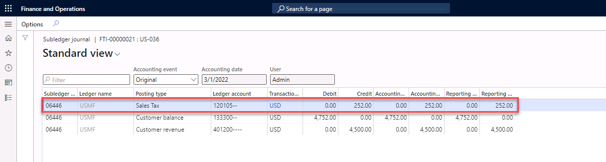

---
lab:
    title: 'Lab: Configure tax ledger posting groups'
    module: 'Module 2: Set up and configure financial management'
---

# Lab Configure tax ledger posting groups

You have a new customer in Arizona. You need to create the customer in the system. You must set up a ledger account to ensure that tax is posted to main account named Arizona State Tax Payable. You must also set up a new sales tax code and use the new sales tax code in a free text invoice. 

Sales tax is calculated and posted to main accounts that are specified in Ledger posting groups. Ledger posting groups are attached to each sales tax code. You can set up individual ledger posting groups for each sales tax code, use one ledger posting group for all sales tax codes or assign multiple ledger posting groups to the sales tax codes. This lab uses the USMF demo company.

 

## Exercise 1 Set up the main account

1. Go to Navigation pane > **Modules** > **General ledger** > **Chart of accounts** > **Accounts** > **Main accounts**.

2. Select **New**.

3. Enter **120105** in the Main account field.

4. Enter **Arizona State Tax Payable** in the Name field.

5. Select **Liability** in the Main account type field.

6. Select **TAXPAY** in the Main account category field. The account category is used for default financial reports and Power BI dashboard content.

7. Scroll down and expand the **Posting validation** tab.

8. Navigate to the **Posting Type** field.

9. Select **Sales Tax**.

10. Select **Save.**

11. Close the form.

 

## Exercise 2 Setup a ledger posting group

Now we have set up the main account, we can set up a ledger posting group.

1. Navigate to **Tax** and select **Setup**. Select **Sales tax** and then select **Ledger posting groups**.

2. Select **New**.

3. Enter **AZ_State** in the **Ledger posting group** field**.**

4. Enter **Arizona State tax** in the **Description** field**.**

5. Select main account **120105** in the **Sales tax payable** field.

6. Select main account **222100** in both the Use tax payable field and the Settlement account field. 

7. Select **Save.**

8. **Close** the form.

To use the ledger AR_State posting group you must:

- Set up a sales tax code for Arizona (exercise 3).

- Create a sales tax group (exercise 4).

- Adjust an item sales tax group (exercise 5).

- Create a customer that uses the new sales tax code (exercise 6).

- Create a free text invoice (exercise 7).

 

## Exercise 3 Create a sales tax code

1. Navigate to **Tax** and select **Indirect taxes**. Select **Sales tax** and then select **Sales tax codes**.

2. Select **New**.

3. Enter **AV_ARIZ** in the **Sales tax code** field,.

4. Enter **Arizona State – Retail Prod** In the **Name** field.

5. Select **GEN** in the **Settlement period** field.

6. Select **Ledger posting group** **AZ_State** to specify the main account for posting sales tax to the general ledger.

7. Select **Sales tax code** from the Action Pane.

8. Navigate to the **Sales tax code** section.

9. Select **Values**.

10. Enter the value **5.6** for in the **V****alue** column. 

11. Select **Save**.

12. Close the Sales tax code values form.

13. Close the Sales tax codes form.

 

## Exercise 4 Expand the sales tax group

1. Navigate to **Tax** and select **Indirect taxes**. Select **Sales tax** and then select **Sales tax group**.

2. Select **New**.

3. Enter **AZ** in the **Sales tax group** field.

4. Enter **Arizona** in the description field. 

5. Expand the Setup FastTab and select **Add**. 

6. Select the Sales tax code **AV_ARIZ**.

7. Select **Save**.

8. **Close** the form.

## Exercise 5 Adjust an item sales tax group

1. Navigate to **Tax** and select **Indirect taxes**. Select **Sales tax** and then select **Item sales tax groups**.

2. Select the **AU/VI** Item sales tax group.

3. Navigate to the Setup FastTab and select **Add**.

4. Select **AV_ARIZ** in the Sales tax code field. 

5. Select **Save**.

6. **Close** the form.

## Exercise 6 Create a customer

1. Navigate to **Accounts receivable**, select **Customers**, and then select **All customers**. 

2. Select **New** to create a new customer.

3. Enter **US-036** in the Customer account field.

4. Select **Organization** as the field type.

5. Enter **Contoso Retail Arizona** in the name field type. If a dialog displays a list of current customers, select **Cancel**.

6. Select **90** in the Customer group field.

7. Select **USD** as the currency.

8. Select **Net10** as the terms of payment.

9. Select AZ as the Sales tax group.

10. Select **USA** as the country.

11. Select **Arizona** as the state. 

12. Select **Save.**

13. Close the customer form**.** 

## Exercise 7 Create a free text invoice

In this exercise, you generate a free text invoice and check the voucher to ensure that that the tax amount is posted on main account 120105.

1. Navigate to **Accounts receivable**, select **Invoices**, and then select **All free text invoices**.

2. Select **New** to create a new invoice. 

3. In the field Customer account type **US-036**.

4. Navigate to the lines and enter **Services FY2022** in the Description field.

5. Select main account **401200**. The sales tax group and Item sales tax groups fields are automatically populated.

6. **Navigate** to the field Unit price and type **4500.**

7. Select **Save**.

8. Select **Post** to post the journal. Select **OK** to confirm. 

9. Navigate to **Sales tax** in the Action Pane.

10. Select **View accounting**. You can see that the sales tax amount is posted to main account 120105. 

 
