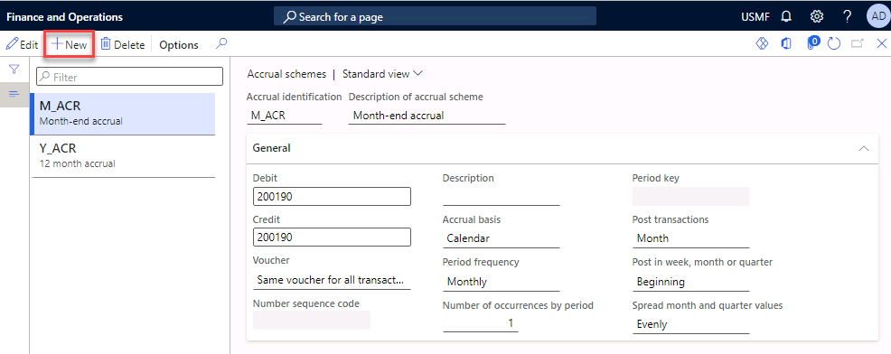
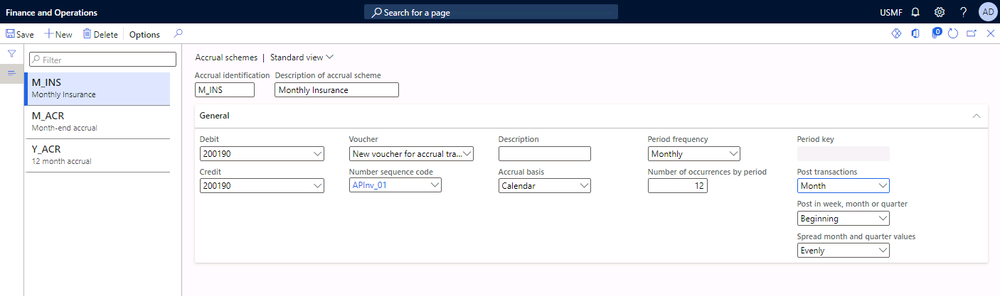
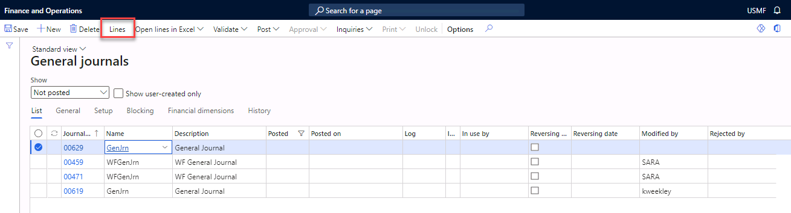
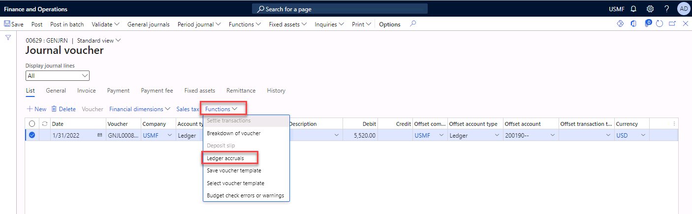
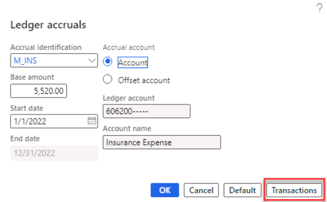
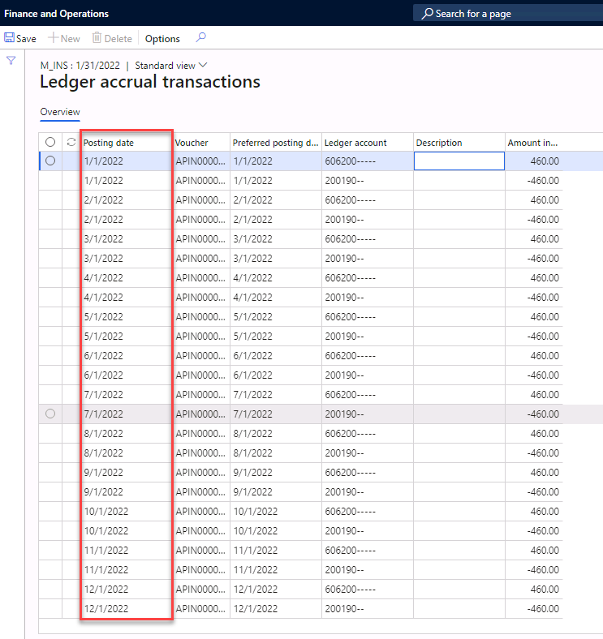
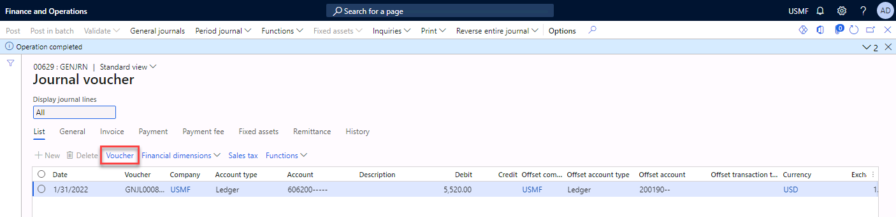
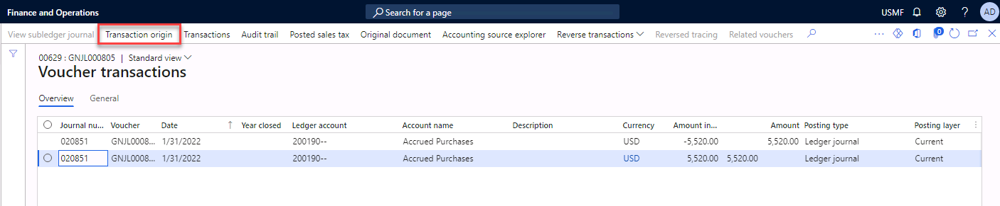
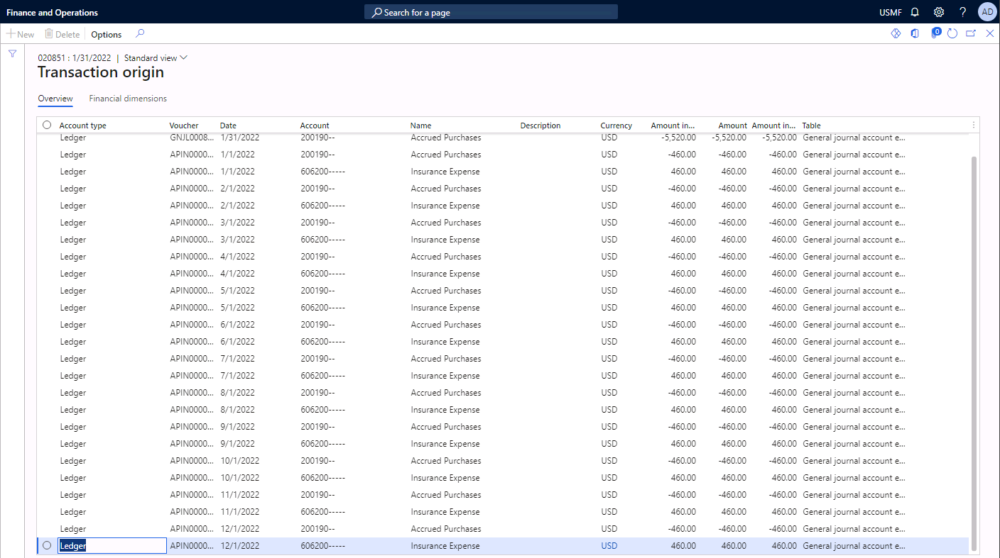

---
lab:
    title: 'Lab: Accrual schemes'
    module: 'Module 2: Set up and configure financial management'
---

# Lab Accrual schemes

You create accrual schemes to set up deferred revenue and costs. Ledger accruals redistribute the costs or revenue of a journal line so that the costs and revenues are recognized in the appropriate periods.

In the Accrual scheme page, you specify the debit and the credit accounts that will be used when the accrual scheme is applied.

- **Debit** - The main account that you define will replace the debit main account on the journal voucher line. This account will also be used for the reversal of the deferral, based on the ledger accrual transactions.

- **Credit** - the main account that you define will replace the credit main account on the journal voucher line. This account will also be used for the reversal of the deferral, based on the ledger accrual transactions.

 

In this lab, you will set up a ledger accrual scheme and use the accrual scheme in a journal.

## Exercise 1 Create an Accrual scheme

In this exercise you set will up a ledger accrual scheme.

 

### Scenario 

The accounting manager at Contoso, Ltd. wants to redistribute the costs of an insurance policy throughout the year. The cost of the insurance policy is $5,520.00. Use the following information to set up a ledger accrual for the insurance policy: 

 

- Pay the total amount for the policy at one time.

- Divide the invoice into twelve payments. 

- Company: **USMF**
 

1. Navigate to company **USMF**, Module **General ledger**, select **Journal** **Setup**, and then select **Accrual schemes.**

2. Select the **+New** button.  
 

3. Enter **M_INS** in the Accrual identification field. Enter **Monthly Insurance** as the description.

4. Select account number **200190** for the Debit and Credit fields.

5. For Voucher, select **New voucher** **for accrual transactions**. 

6. Select **APInv_01** number sequence code. 

7. Select **Calendar** as Accrual basis 

8. Select **Monthly** as the Period frequency.

9. Type **12** as Number of occurrences by period.

10. Select **Month** as the Post transactions 

11. Select **Beginning** in the Post in week, month or quarter field.

12. Select **Evenly** in the Spread month and quarter values field

13. Save your settings and close the form. 

## Exercise 2 Apply the accrual scheme 

In this exercise you will apply the accrual scheme from exercise 1 in a journal.

1. Navigate to module **General ledger,** select **Journal entries**, and then select **General journals.**   

2. Select the **New** button to create a new journal. 

3. Select **GenJrn** in the Name field. 

4. Select the **Lines** button in the action pane. 

5. Type **1/31/2022** in the Date field. 

6. Type **606200** in the Account field, you can leave the dimensions fields empty.

7. Type **5520.00** in the Debit field. 

8. Select main account **200190** in the Offset account. 

9. Navigate to **Functions** and select **Ledger accruals**. 

10. In the Accrual identification field, select **M_INS**. 

11. Set the start date to January 1, 2022. 

12. Select transactions. You will see that the costs are divided over the 12 defined periods.

13. Close the screen, you will return to the previous screen.

14. Select **OK** to accept the transactions and return to the journal line.

15. Select **Post** from the **Action pane** to post the journal. 

16. **Select** Voucher

17. Select **Transaction Origin** to see the different journal lines per period. 

18. Close all forms

