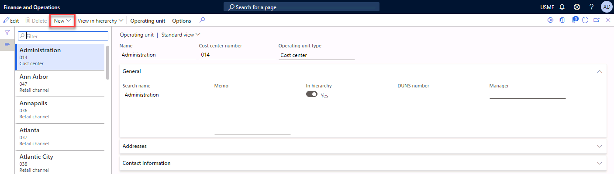
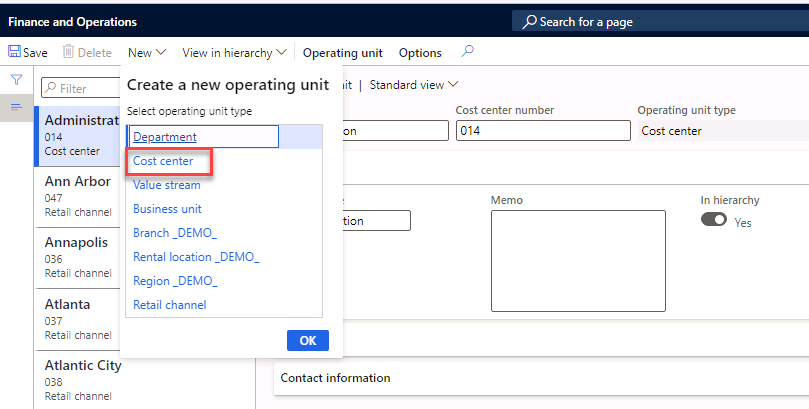
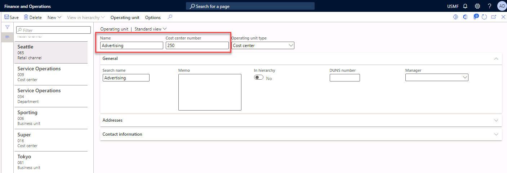
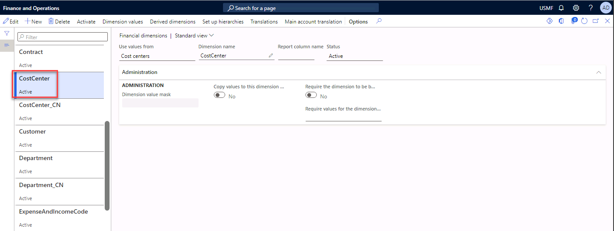
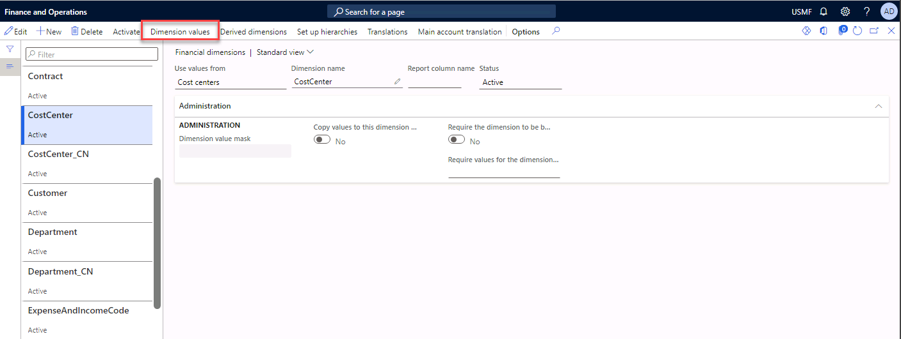
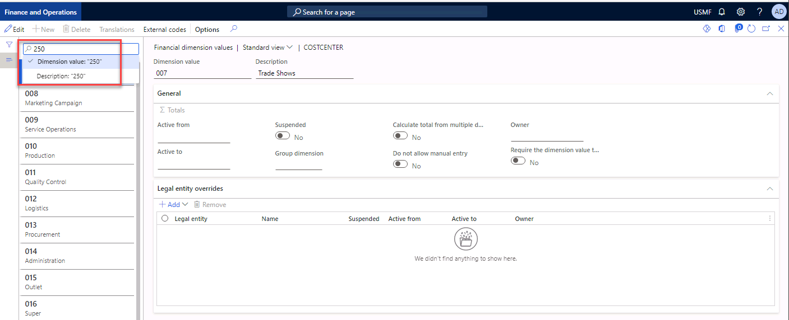
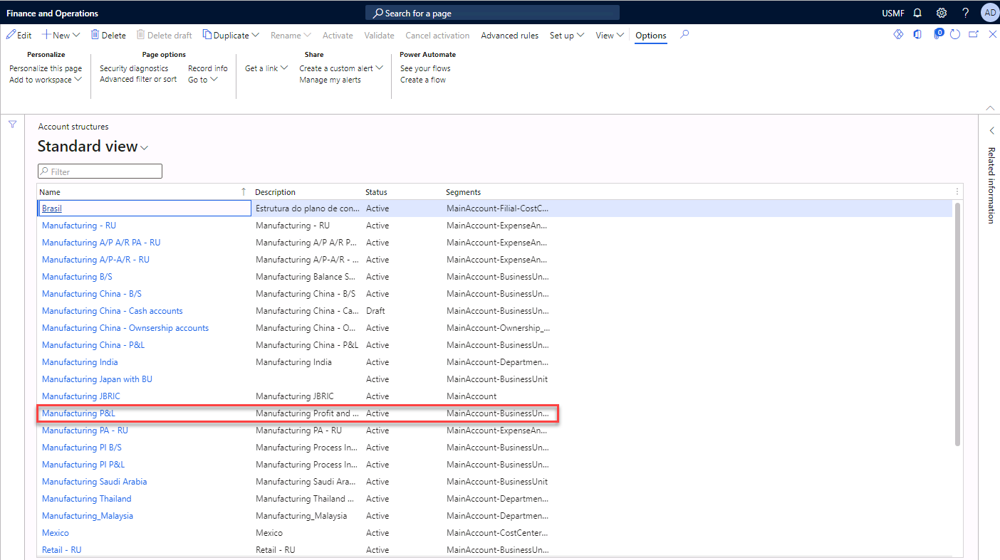
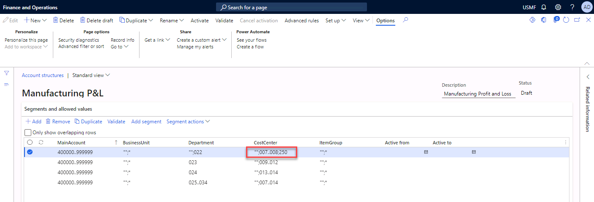
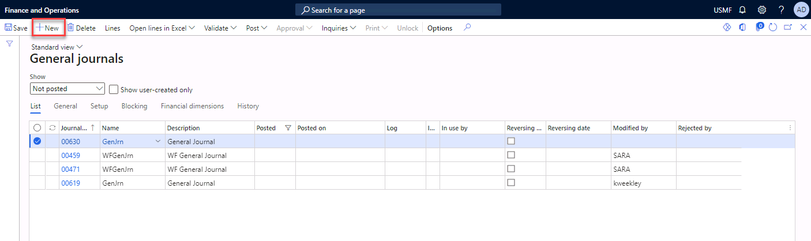
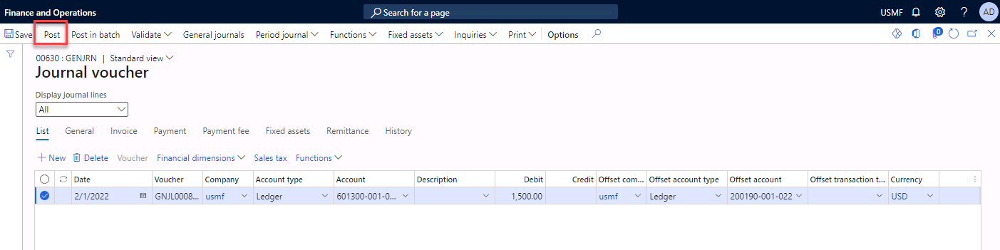

---
lab:
    title: 'Lab: Configure a dimension value'
    module: 'Module 2: Set up and configure financial management'
---

# Lab Configure a dimension value

You can use the Financial dimensions page to create financial dimensions and use these dimensions as account segments for charts of accounts. If you created a financial dimension, you can use the Financial dimension values page to assign additional properties to each financial dimension.

There are two types of financial dimensions: custom dimensions and entity-backed dimensions. Custom dimensions are shared across legal entities, and the values are entered and maintained by users. For entity-backed dimensions, the values are defined somewhere else in the system, such as in Customers or Stores entities.

Use the USMF company for the exercises in this lab.

 

## Exercise 1 Create a new dimension value

During this lab you are going to add a new financial dimension value to an existing financial dimension. 

 

**Scenario** 

 

Contoso, Ltd. has a new Sales and Marketing department. You need to set up the department as a cost center so that you can create a report of advertising costs for the cost center. This cost center is an example of an entity-backed dimension. The value of this dimension is defined somewhere else in the system. 

1. Navigate to **Modules** > **Organization administration**, select **Organizations**, and then select **Operating units.**

2. Select the **New** button to create a new operating unit. 

 

3. Select **Cost Center**. 

 

4. Enter **Advertising** in the Name field. 

5. Enter **250** in the Cost center number field.

6. Select **Save.**

## Exercise 2 Check whether the value has been created correctly.

1. Navigate to **General ledger** and select **Chart of Accounts**. Select **Dimensions** and then select **Financial dimensions**.

2. Select the **CostCenter** dimension on the left.

3. Select the **Dimension values** menu item. 

 
4. Enter **250** in the Filter field. 

5. Select **Dimension value** in the filter field and press **enter**. 

 

6. Ensure that the dimension value 250 (with the description Advertising) appears in the list. Note that you cannot enter a dimension value for the financial dimension cost center because this is **an** **entity-backed** dimension.   

## Exercise 3 Add the value to the account structure. 

In USMF, the Manufacturing P&L account structure is set up as profit and loss main accounts. You need to make a journal entry for the cost center that you created in the account structure. 

1. Navigate to **General ledger** and select **Chart of accounts**. Select **Structures** and then select **Configure account structures**. 

2. Select the **Manufacturing P&amp;L** link.

3. Select **Edit**.

    Note: The new Cost Center 250 Advertising already belongs to the Sales and Marketing department 022. You need to adjust the line in the account structure which refers to department 022. The purpose here is to configure the account structure so that if the sales and marketing dimension is selected in a journal line, only the cost centers 007 Trade Shows, 008 Marketing campaign, and 250 Advertising will be available for selection.  

4. Enter the following information in 022's Cost Center field: **" ", 007..008; 250**

    Note: The following symbols are used in the cost center field:  

    | **Symbol**| **Meaning** |
    | - | - |
    | " "| Blank values are allowed. |
    | ..| A range of values is allowed. For the entry in step 4, the range of numbers from 007 to 008 is allowed |
    | ;| And. For the entry in step 4, blank values are allowed and the range of numbers from 007 to 008 is allowed. |

    

5. Select the **Activate** menu item. 

6. Select **Activate** to start the process. 

7. **Close** the form. 

8. You need to give the system time to activate the account structure. Wait at least one minute before you start exercise 4. 

 
## Exercise 4 Apply the new financial dimension value in a Journal

1. Go to Navigation pane > **Modules** > **General ledger** > **Journal entries** > **General journals**

2. Select the **New** button to create a new journal

3. Select **GenJrn** in the Name field. 
4. Select the **Lines** button in the action pane. 

5. Enter **1/5/2022** in the Date field.

6. Enter **601600** in the Account field.

7. Select dimension Business Unit **001**, dimension Department **022,** and dimension cost center **250.**

8. Enter **1500.00** in the Debit field. 

9. Select main account **200190** in the Offset account field. 

10. **Post** the journal. 

11. Close the form.
