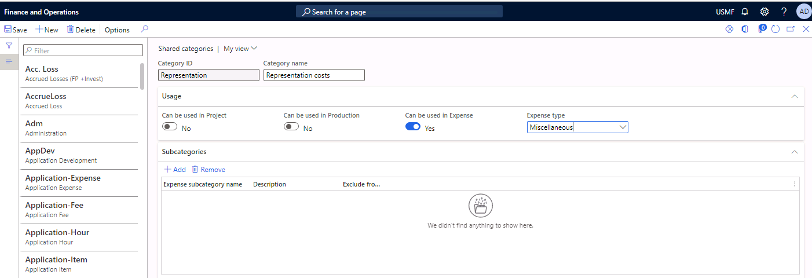
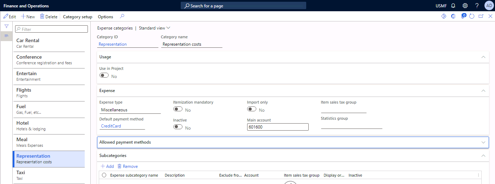
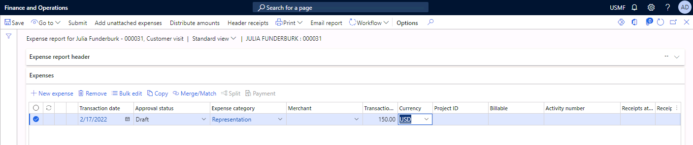
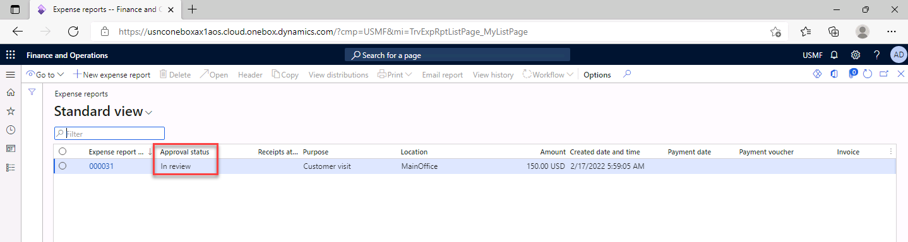

---
lab:
    title: 'Lab 1: Configure an expense category'
    module: 'Module 3 Optional'
---

# Lab Configure an expense category 

Employees must assign their expenses to predefined categories when they are completing expense reports. You can create the following types of expense categories:

- Categories for use by a single company - This type of category includes information about payment methods, expense types, cost splitting, and subcategories. These expense types can be used only for expenses that are charged to the company in which they are created.

- Shared categories - Any legal entity in your enterprise can use shared expense categories.

 

**Scenario** 

 

A financial controller at Contoso is setting up a new expense category that allows employees to declare representation costs (for example, a business lunch with a potential customer and costs for business events such as conferences or promotional gifts).

## Exercise 1 Configure a shared category 

 

You must create a category named **Representation costs** and track these costs a miscellaneous expense type with a default method of payment method of Company Credit Card. These expenses must be posted to account 601600, Promotional Expenses.

 

 

1. Navigate to the module **Expense management** and select **Setup**. Select **General** and then select **Shared categories**.

2. Select **New** to create a new shared category.

3. Enter **Representation** in the Category ID field.

4. Enter **Representation Costs** in the category name field.

5. Set the value of the Can be used in Expense field to **Yes**.

6. Select Miscellaneous from the Expense type drop-down list.

7. Save the data.

8. Close the form. 

## Exercise 2 Configure an expense category

1. Navigate to **Expense management** and select **Setup**. Select **General** and then select **Expense categories**. 

2. Select **New** to create a new expense category.

3. Select **Representation** in the Category ID field.

4. Select **CreditCard** in the default payment method field which is in the **Expense** fasttab.

5. Enter **601600** in the Main account field. 

6. **Save** the data.

7. **Close** the form. 

 

## Exercise 3 Create an expense report that uses the new expense category

1. Navigate to **Expense management**, select **My expenses**, and then select **Expense reports**.

2. Select **New expense report** to create a new report.

3. Select **Customer** **visit** in the purpose field.

4. Select **Main office** in the location field. 

5. Select **OK.**

6. Enter **2/1/2022** as the transaction date.

7. Select **Representation** in the Expense category.

8. Type **150.00** in the Transaction amount field.

9. **Save** the data.

10. Select **Workflow** in the action pane. You may need to select the ellipsis (...) to see the option.

11. Select **Submit**.

12. Enter **Dinner with a potential customer** in the comment field.

13. **Submit** the expense report.

The approval status of the expense report will change to In review.
