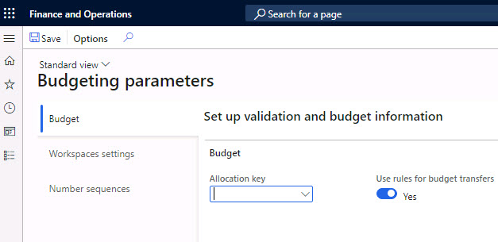
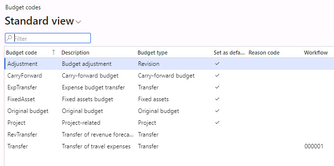

---
lab:
    title: 'Lab: Create a budget transfer rule'
    module: 'LP 4: Configure and manage budgeting'
---

# Lab: Create a budget transfer rule

## Objective

**Budget transfer rules** determine when budget transfers are allowed between financial dimension values.  For example, budget transfers in a specific department might be allowed without approval, but transfers across departments might need to be reviewed and approved before the budget balance is adjusted. If a budget register entry is submitted and it violates the budget transfer rules, the transfer can be completed only if it is approved through a **Budgeting workflow**.

A budget manager has been analyzing recent travel expenses and wants to make some changes to the budget to better align the budgets with the travel policies of the company. You need to set up transfer rules. You must be able to review and approve transfer requests. 

1.  Open your **Dynamics 365 Finance** environment and using the **Company picker**, change the legal entity to **USMF**. 

## Exercise 1: Define dimensions for budgeting

1.  In the **Budgeting** module, select **Setup**. Select **Basic budgeting**
    and then select **Dimensions for budgeting**. 

2.  Determine whether the **Department** financial dimension is selected as a
    budget dimension. In this example the department is set up as a budget
    dimension.

3.  Select **OK** to close the form.

    
	

# Exercise 2: Define budget transfer rules

In this exercise you will set up a rule that does not allow budget transfers outside of the rule members unless you use a workflow to approve the transfer. If no criteria are specified, the rule applies to all dimension values. 

1.  In the **Budgeting** module, select **Setup**. Select **Basic budgeting**
    and then select **Budget transfer rules**.

2.  Select **New** to create a new budget transfer rule.

3.  Enter `CLIENT` for the **Budget transfer rule**.

4.  Enter the **Description** as `Client Services`.

5.  Select or enter `Manufacturing P&L` for **Account structure**.

6.  Select **+Add** in the toolbar, to add a new rule and enter `CLIENT` in the **Rule member**
    field. Select *Add*. 

7.  In the **Allow transfers when** section, select **+ Add new criteria**. 

8.  In the **Where** field, select `Department` and select **is** as the **Operator**. 

9.  Enter `028` in the **Value** field. 

10. Select **Save** and close the form. 

# Exercise 3: Define budget parameter for budget transfer rules

In this exercise you enable a budget workflow for the budget transfer rule. 

1.  In the **Budgeting** module, select **Setup**. Select **Basic budgeting**
    and then select **Budgeting parameters**. 

2.  Navigate to **Use rules for budget transfers** and set the field to **Yes**.

3.  Select **Save** and close the form. 

    

# Exercise 4: Validate the budget register entry workflow

1.  In the **Budgeting** module, select **Setup**. Select **Basic budgeting**
    and then select **Budgeting workflows**.
    
2.  Verify the budget register entry workflow has been created and is active. 

3.  **Close** the form. 

# Exercise 5: Define budget code

In this exercise you configure a budget code for the budget type transfer.

1.  In the **Budgeting** module, select **Setup.** Select **Basic budgeting**
    and then select **Budget codes**.

2.  Select **+New** to create a new budget code.

3.  Enter `Transfer` in the **Budget code** field. 

4.  Enter `Transfer of travel expenses` in the **Description** field. 

5.  Select `Transfer` in the **Budget type** field. 

6.  Select `000001 Budget register entry workflow` in the **Workflow** field.

7.  Select **Save** and close the form. 

    

# Exercise 6: Create a budget register entry

In this exercise you will see what happens when you enter a budget register entry. 

## Task 1

In this task you will add a budget register entry. 

1.  In the **Budgeting** module, select **Budget register entries**. 

2.  Select **+New** to create a new budget register entry. 

3.  Select **FY2023** in the **Budget model** field. 

4.  Select **Transfer** in the **Budget Code** field. 

5.  Under **Budget account entries**, select **+Add line** in the toolbar, to create a new line. 

7.  Select **1/1/2021** in the date field. 

8.  Select or enter `Manufacturing P&L` in the **Account structure** field. 

9.  Enter `601506-001-028--` in the **Dimension values** field. 

10. Enter `1000` in the **Amount** field. Do not navigate away from this page. 

## Task 2

In this task you will add a second line for the same dimension combination.

1.  Select **+Add line** to create another new line. 

2.  Select **1/1/2021** in the date field. 

3.  Select or enter `Manufacturing P&L` in the **Account structure** field. 

4.  Enter `601505-001-022--` in the **Dimension values** field. 

5.  Enter `-1000` in the **Amount** field. 

6.  Select **Save**. 

7.  The following message should display: **This budget transfer violates a budget
    transfer rule and is not allowed unless you use workflow to approve the
    transfer.**

8.  Select **Close**. 

9.  Select **Workflow** in the Action Pane.

10. Under **Submit budget revision for approval**, select **Submit**. 

11. A pane appears where you can leave a **Comment**. Enter the text
    `Approval needed` and select **Submit**. The workflow is started. 

