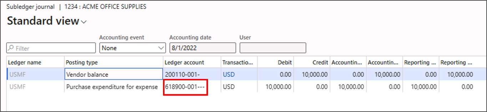
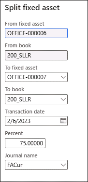
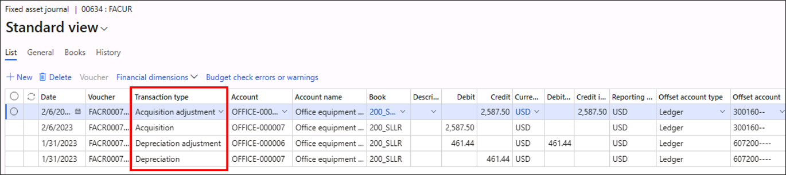

---
lab:
    title: 'Lab: Fixed asset transactions'
    module: 'Module 5: Manage fixed assets'
---

## Objective

In this lab, we will test fixed asset acquisition, depreciation and split.

- In the first scenario, we will create a fixed asset and post an acquisition transaction that will be six months old. There will be a depreciation transaction on the same fixed asset on current date.

-  In the second scenario, we will create another fixed asset and post an acquisition transaction on current date. We will split a portion of the previous fixed asset and merge it with the new fixed asset. We will examine the net asset value of both the fixed assets after this transaction.

## Exercise 1: Create a new fixed asset

1. Navigate to **Fixed assets &gt; Fixed assets** and open **Fixed assets**.

2. Select the **+New** button in the action pane to create a new fixed asset.

3. Enter data into the following fields:

	- **Fixed asset group**: OFFICE

	- **Number**: [Auto-generated]

	- **Name**: Office equipment - [[Year/Quarter of six month old date]]

	- **Type**: Tangible

4. Select the **Save** button in the action pane and close the page.

## Exercise 2: Create a new vendor invoice

1. Navigate to **Accounts payable &gt; Invoices** and open **Pending vendor invoices**.

2. Select the **+New** button in the action pane to create a new vendor invoice.

3. In the **Vendor invoice** page, enter the following values:

	- **Invoice account**: 1001

	- **Number**: 1234

	- **Invoice description**: Office equipment - [Year/Quarter of six month old date]

	- **Invoice date**: [six months old date from current date]

	- **Posting date**: [same as invoice date]

4. Select the **Add** line button in the **Lines** FastTab of the **Vendor invoice** page and enter the following values:

	- **Procurement category**: Select Computers under OFFICE MACHINES

	- **Quantity**: 10

	- **Unit**: ea

	- **Unit price**: 1000

	- **Line net amount** (auto-updated): 10000

5. Select the **Financials** button in the action pane [you may need to hit the ellipsis ...] and select the **View accounting** button under the **Accounting** section.

	

6. Note down the **ledger account** for the Posting type Purchase expenditure for expense and close the **Subledger journal** page.

7. Post the invoice journal by selecting the **Post** button in the action pane.

8. Close the **Pending vendor invoice** page.

## Exercise 3: Post acquisition journal

1. Navigate to **Fixed assets &gt; Journal entries** and open **Fixed assets journal**.

2. Select the **+New** button in the action pane to create a new fixed asset journal of **Name** FACur.

3. Select the **Lines** button in the action pane to open the journal lines.

4. In the journal lines, enter the following values:

	- **Date**: [Enter the posting date that you entered in Exercise 2, which is six months ago]

	- **Voucher**: [Auto-generated]

	- **Transaction type**: Acquisition

	- **Account**: [Select the newly created fixed asset, which will be the last asset in the Fixed asset group OFFICE]

	- **Book**: 200_SLLR

	- **Debit**: 10000

	- **Offset account type**: Ledger

	- **Offset account**: [Ledger account you noted in step 6 of Exercise 2]

5. Select the **Post** button in the action pane and close the **journal** page.

6. Navigate to **Fixed assets &gt; Fixed assets**, open **Fixed assets** and navigate to the newly created fixed asset.

7. Select the **Valuations** button in the action pane and in the **200_SLLR book**, you will find an acquisition of **10000** has been made for the new fixed asset.

 

## Exercise 4: Post depreciation journal

1. Navigate to **Fixed assets &gt; Journal entries** and open **Create depreciation proposal**.

2. In the **Depreciation proposal** dialog, enter the following values:

	- **Posting layer**: Current

	- **Legal entities**: USMF

	- **Name of journal**: FACur

	- **To date**: [current date]

	- **Fixed asset number**: [Select the newly created fixed asset] in USMF

	- **Fixed asset group**: OFFICE in USMF

	- **Book**: 200_SLLR in USMF

	- **Batch processing**: No

3. Select the **Create journal** button to process the proposal.

4. Navigate to **Fixed assets &gt; Journal entries** and open **Fixed assets journal**.

5. A new depreciation journal will be created showing depreciation lines till the current date. You can post the journal by selecting the **Post** button in the action pane.

6. Navigate to **Fixed assets &gt; Fixed assets**, open **Fixed assets** and navigate to the newly created fixed asset.

7. Select the **Valuations** button in the action pane and in the **200_SLLR book**, you will find the **net book value** has changed based on the depreciation calculation.

## Exercise 5: Create another new fixed asset 

Hint: See Exercises 1-3 for the detailed steps

1. Create another new fixed asset under fixed asset group OFFICE with **Name**: Office equipment - [Year/quarter based on current date].

2. Create a **Pending vendor invoice**, incrementing the Invoice Number, on the current date of **amount** 500 [for a total amount of 5000].

3. Create an **acquisition journal** based on the current date.

4. Check the valuation of the new fixed asset, where the **net book value** should be **5000**.

## Exercise 6: Split the old fixed asset 

1. Navigate to **Fixed assets &gt; Fixed assets**, open **Fixed assets** and navigate to the fixed asset created first.

2. Select the **Books** button in the action pane and navigate to book **200_SLLR**.

3. In the action pane, select **Split fixed asset** under the **Functions** button.

	

4. Enter the following data in the **Split fixed asset** dialog and select the **OK** button.

	- **To fixed asset**: [Newly created fixed asset]

	- **To book**: 200_SLLR

	- **Transaction date**: [current date]

	- **Percent**: 75

	- **Journal name**: FACur

5. Navigate to **Fixed assets &gt; Journal entries** and open **Fixed assets journal**.

6. In the journal **lines**, you will find four transactions. There will be two acquisition and depreciation transactions for the new fixed asset. There will also be two adjustment transactions for the old fixed asset.

	

7. Select the **Post** button in the action pane and close the **Fixed asset journal** page.

8. Navigate to **Fixed assets &gt; Fixed assets**, open **Fixed assets** page and navigate to both the fixed assets.

9. Select the **Valuation** button in the action pane and in the **200_SLLR book**, you will find the **net book value** has changed for both the fixed assets after the split transaction.
