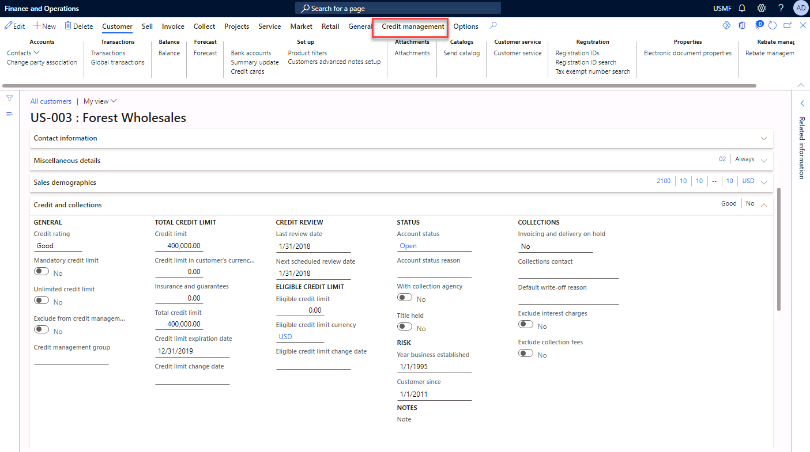
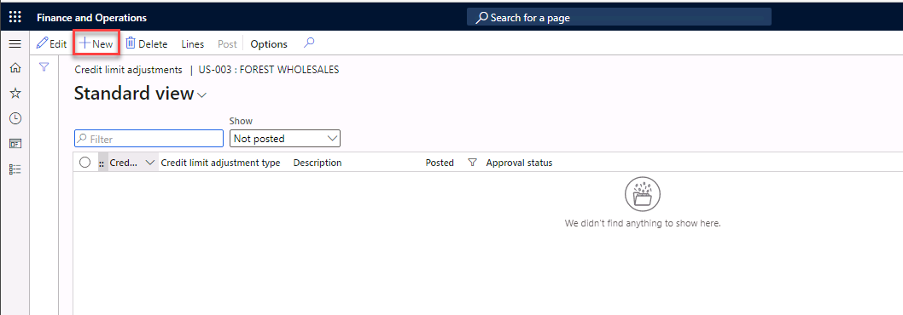
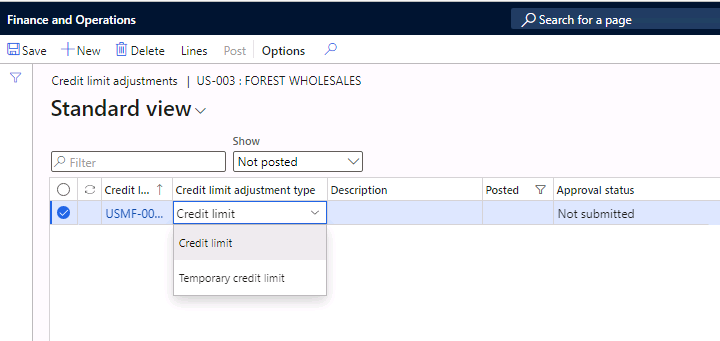
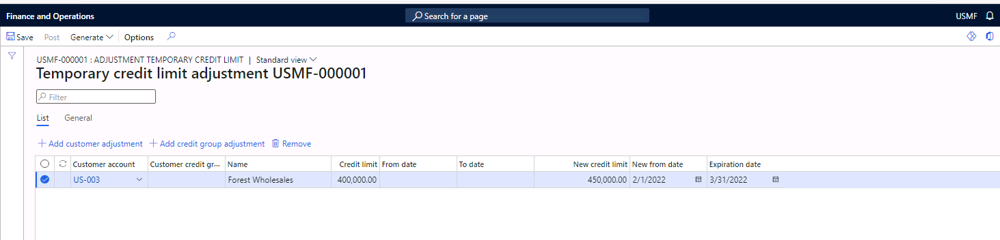

---
lab:
    title: 'Lab: Create a temporary credit limit for a customer'
    module: 'Module 6: Implement and manage accounts receivable'
---

# Lab Create a temporary credit limit for a customer

Temporary credit limits override customer credit limits for a defined period. You can add temporary credit limits by using credit limit adjustments. These adjustments let credit managers update the credit limits and end dates of a single customer, a group of customers, or all customers through a posting process. 

## Exercise 1 Add a temporary credit limit for a customer

In this exercise you will set up a temporary credit limit for a customer of Contoso, Ltd. 

### Scenario 

You need to set up a temporary credit limit for customer US-003 in legal entity USMF. The current credit limit for the customer is $400,000, until the end of next month, the limit is 500,000.

 

### Task 1 Identify the current credit limit for the customer

1. Navigate to the module **Credit and Collections**, select **Customers**, and then select **All customers.**

2. Select customer **US-003**.

3. Review the Credit and Collections fasttab. The total credit limit is $400,000. Do not navigate away from this page.

 

 

### Task 2 Create a temporary credit limit adjustment

1. Select the **Credit management** menu item on the action pane. You may need to select the ellipsis (...) to see more options. 

 

2. Under **New**, select **Credit limit adjustments**.
3. Select **New** to create a new header. 

4. Select **Temporary credit limit** in the field Credit limit adjustment type field. 

 

7. Enter the text **Temporary credit limit** for the Description.

8. Select the **Lines** menu item. 

 

9. Select **US-003** in the customer account field.

10. Type 450,000 in the New credit limit field. 

11. Select **any date last month** in the New from date field.

12. Select **any date next month** in the Expiration date field. These two dates ensure that today is between the from date and the expiration date of the temporary credit limit.
13. **Save** the data. 

14. **Post** the journal.

15. Close the form.

 

### Task 3 Verify the temporary credit limit

 

1. Navigate to **Credit and Collections**, select **Customers**, and then select **All customers.**

2. Select customer **US-003.**

3. Review the Credit and Collections tab. The total credit limit is $400,000. You will see the new temporary credit limit is added. 

 
