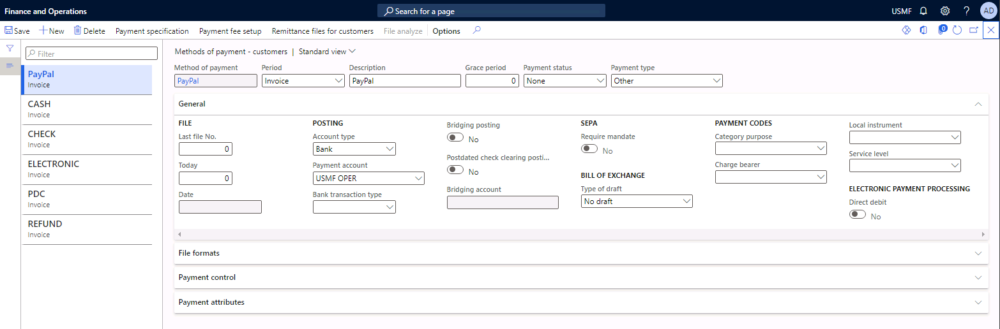
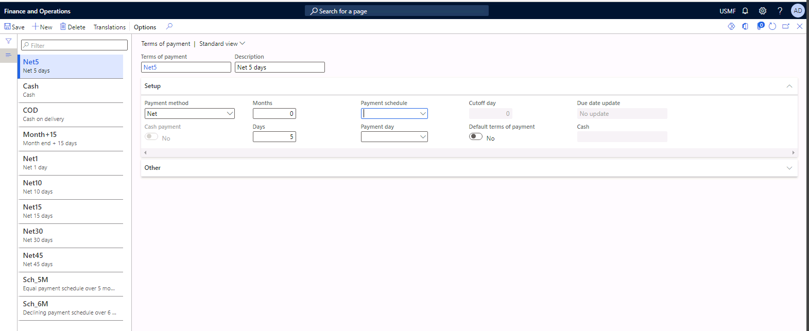

---
lab:
    title: 'Lab: Configure payment methods, terms, and days for customers'
    module: 'Module 6: Implement and manage accounts receivable'
---

# Lab Configure payment methods, terms, and days for customers

Payment terms determine how you manage due dates. The same payment terms are available for sales and purchase documents. When you post an invoice, the due date is calculated based on the payment terms. Each payment type that a company accepts must be configured when the system is set up.

You can use payment days to define the payment day used for calculating the due date. Payment day can be specified for either a day in the week or in the month. This helps payment proposal to suggest those customer invoices that should be brought into the customer payment journal for posting.

In this this lab you will set up a payment method for customers. You will then set up terms of payment. Finally, you will set up a payment day. 

**Scenario** 

You need to set up a new payment method for the customers so that they can use PayPal as a payment method. You also need to configure terms of payment for net payment within five days. You must configure a payment date for the first of each month. 

 

## Exercise 1 Configure a payment method

1. Navigate to the module **Accounts Receivable**, select **Payments setup**, and then select **Methods of payment**.

2. Select **New** to create a new method of payment.

3. Type **PayPal** in the method of payment field. 

4. Select **Invoice** (one payment transfer for each invoice) in the period field. 

5. Type **PayPal** in the description field. 

6. Select **Other** in the Payment type field.

7. Select **Bank** in the Account type field in the **General** fasttab.

8. Select **USMF OPER** in the Payment account field. 

9. Save the data.

 

## Exercise 2 Configure terms of payment
1. Navigate to **Accounts Receivable**, select **Payments setup**, and then select **Terms of payment**.

2. Select **New** to create new terms.

3. Enter **Net5** in the Terms of payment field.

4. Enter **Net 5 days** in the description field.

5. Enter **5** in the Days field in the **Setup** fasttab. 

6. **Save** the data.
  

### Exercise 3 Configure Payment days
1. Navigate to **Accounts Receivable**, select **Payments setup**, and then select **Payment days**. 

2. Select **New** to create a new payment day.

3. Enter **1st** in the field payment day.

4. Enter **1st day of the month** in the description field. 

5. Select **Month** in week/month field.

6. Select **1** in Day of the month. 

7. **Save** the data. 

### Exercise 4 Add the new settings to a customer
1. Navigate to **Accounts Receivable**, select **Customers**, and then select **All customers**.

2. Select **US-040**.

3. Navigate to the fasttab **Payment defaults**.

4. Select **Net5** in the Terms of payment field.

5. Select **PayPal** in the method of payment fee.

6. Select **1st** in the Payment day field. 

7. Save the data. 

 

 
