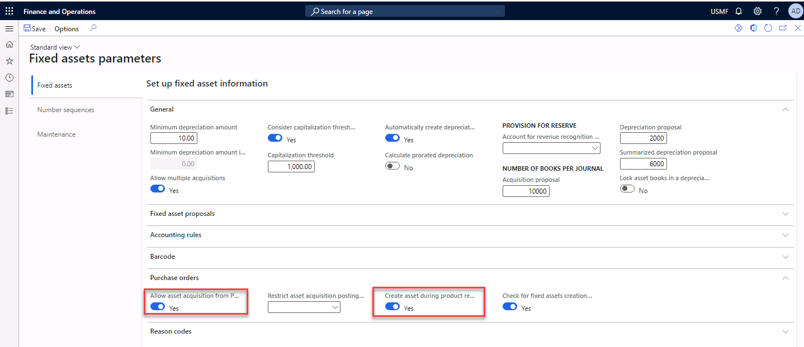
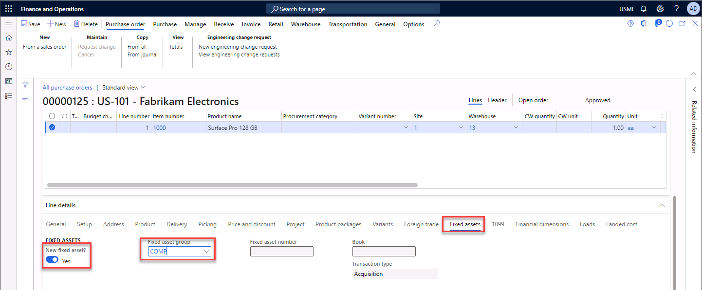
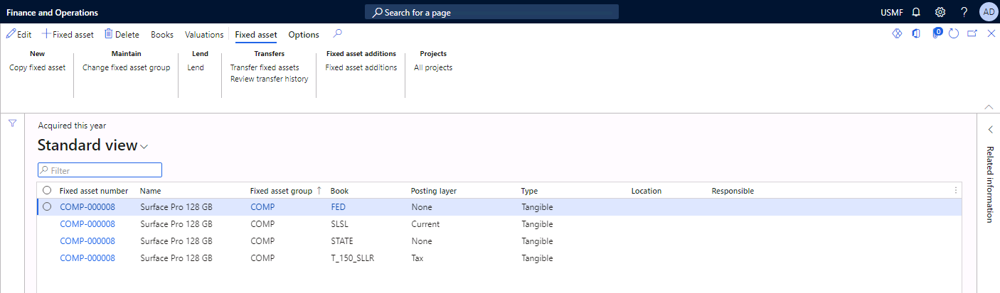

---
lab:
    title: 'Lab 1: Acquire a fixed asset by using an AP invoice journal'
    module: 'Module 5 Optional'
---

# Lab: Acquire a fixed asset by using an AP invoice journal 

## Objective
 
Contoso, Ltd. purchases a new laptop for an employee who will start next month. You receive notification from the warehouse manager that the laptop has been received at the warehouse. You must create and record the fixed asset for the laptop. 

1.  Open your **Dynamics 365 Finance** environment and using the **Company picker**, change the legal entity to **USMF**. 

## Exercise 1: Set Fixed assets parameters

It is possible to automatically create a fixed asset during the purchasing process. You can set this up in the parameters in the fixed assets module. 

1.  In the **Fixed assets** module, select **Setup** > **Fixed assets parameters**. 

2.  Expand the **Purchase orders** FastTab. 

3.  Set the **Allow asset acquisition from Purchasing** field to **Yes**. 

4.  Set the **Create asset during product receipt or invoice posting** field to **Yes**. 

    

5.  **Save** and **close** the form.

## Exercise 2: Create a purchase order for a fixed asset

1.  In the **Accounts payable** module, select **Purchase orders** > **All purchase orders**. 

2.  Select **+New** to create a new purchase order. 

3.  Select or enter `US-101` in the **Vendor account** field. Most fields are automatically populated.

4.  Expand the **General** FastTab and select or enter `13` in the **Warehouse** field.  

5.  Select **OK**. 

6.  In the **Purchase order lines** grid, enter `1000` in the Item number field. 

7.  Scroll to the **Line details** FastTab. Expand it, if needed. 

8.  Select the **Fixed assets** tab. 

    > **Note:** You may need to scroll right using the arrows to see it.

9.  Set the **New fixed asset?** field to **Yes**. 

10. Select or enter `COMP` in the **Fixed asset group** field. 

    

11. **Save** the purchase order. 

12. Make a note of the **Purchase order number**. You will use this in the next exercise. 

13. **Close** the form. 

## Exercise 3: Confirm the purchase order

The purchase order has been approved. You must now select and approve the order. 

1.  In the **Accounts payable** module, select **Purchase orders** > **All purchase orders**. 

2.  Select the **PO number** noted in Exercise 2, Step 12. 

3.  Select the **Purchase** tab in the action pane. 

4.  In the **Actions** section, select **Confirm**. The **Purchase order status** will change from **Approved** to **Received**. 

5.  **Close** the form. 

## Exercise 4: Confirm receipt of the laptop

The vendor delivers the laptop. The warehouse manager posts the product receipt and lets you know that the laptop is received in the warehouse. 

1.  In the **Accounts payable** module, select **Purchase orders** > **All purchase orders**. 

2.  Select the **PO number** noted in Exercise 2, Step 12. 

3.  Select the **Receive** tab in the action pane. 

4.  In the **Generate** section, select **Product receipt**. 

5.  Enter `12345` in the **Product receipt** field. 

6.  Select **OK**. The following warning may display: *The shipment for load could not be confirmed because it is in Shipped status.*
    
    You can continue the exercise. The status of the Purchase order will change from **Approved** to **Confirmed**. 

7.  Navigate to the **Line details** FastTab, expand it if necessary. 

8.  Select the **Fixed assets** tab. 

9.  Verify the **Fixed asset number** field is populated. This occurs after receiving the item in the warehouse. 

10. **Close** the form. 

## Exercise 5: Register and post the vendor invoice

In this exercise you will register and post the vendor invoice for the laptop. In this example, you will perform this operation from the purchase order. 

1.  In the **Accounts payable** module, select **Purchase orders** > **All purchase orders**. 

2.  Select the **PO number** noted in Exercise 2, Step 12. 

3.  Select the **Invoice** tab in the action pane.

4.  In the **Generate** section, select **Invoice**. You will see that the **Match status** of the Purchase order is **Not performed**. 

5.  Select the **Update match status** button in the action pane. Verify the status changes to **Passed**. 

6.  In the **Vendor invoice header** FastTab, in the INVOICE IDENTIFICATION section, enter `456-123` in the **Number** field. 

7.  In the **Invoice description** field, enter `Laptop-finance department`

8.  In the **Invoice date** field, in the Invoice dates section, select the calendar and select **Today**. 

9.  Select **Save** and **Post** in the action pane. The following notification will display: The vendor invoice posting process is complete for Vendor US-101, invoice 456-123. 

    The fixed asset is acquired. 

10. **Close** the form. 

## Exercise 6: Check the fixed asset

In this exercise you will validate that you entered the fixed asset in the system correctly. 

1.  In the **Fixed assets** module, select **Workspaces** > **Fixed asset management**. 

2.  Select the **Acquired this year** tile. You will see the fixed asset listed. 

3.  Select **Valuations** in the action pane to check the acquisition price. 

4.  **Close** the view and **close** the page. 

    

